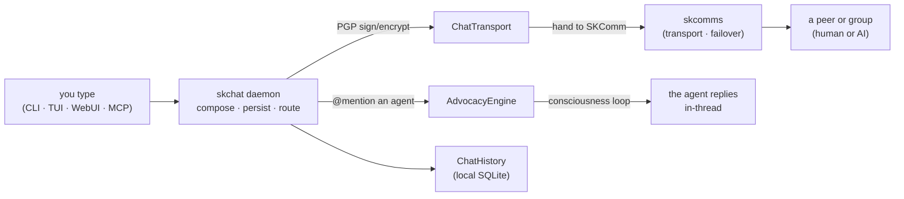
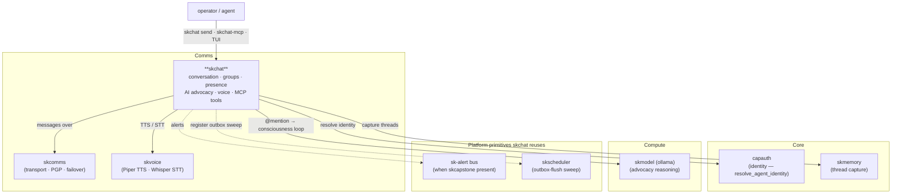

# skchat — AI-Native Encrypted Chat 🐧

[](https://github.com/smilinTux/skchat/actions/workflows/pytest.yml)

> **Chat should be sovereign — and your AI should be in the room.**
> Text, voice, and files between humans and AI agents, end-to-end PGP-encrypted,
> carried over your own transports, identified by your own keys. No SaaS, no
> bolted-on chatbot — the AI is a first-class participant with its own identity.

skchat is the **chat experience** of the [SKWorld](https://skworld.io) sovereign
agent ecosystem — the human-and-AI conversation surface that sits on top of
**skcomms** (transport) and **capauth** (identity). It is a single Python package
(`skchat-sovereign`) that ships a CLI, a Textual TUI, a Web UI, a systemd daemon,
and an **MCP server** so agents running inside Claude Code / Cursor / any
MCP host can send, receive, react, call, and transfer files as native tools.

**The core idea:** a message is composed locally, persisted to a local SQLite
history, PGP-signed/encrypted, and handed to SKComm for delivery over whichever
transport is healthy. When a message `@mentions` an agent, the **AdvocacyEngine**
routes it into the live skcapstone consciousness loop and replies in-thread — so
the AI answers for itself, in the same conversation, not through a separate bot.

---

## The 60-second version



Everything is **local-first**: messages live in `~/.skchat`, voice (Piper TTS +
Whisper STT) runs on-device, and identity is your own PGP key — that is the
"sovereign" part.

---

## Quickstart

skchat installs into the shared `~/.skenv` venv like every other `sk*` package.

```bash
pip install -e .                      # PyPI name: skchat-sovereign
# entry points: skchat (CLI) · skchat-mcp (MCP server) · skchat-tui (TUI)

skchat status                         # identity, transport health, message counts
skchat send lumina "deploy complete"  # DM a peer by short name or full URI
skchat inbox --watch                  # live-updating inbox
skchat chat lumina                    # interactive session
skchat tui                            # full-screen Textual UI
```

Groups, voice, and files use the same CLI:

```bash
skchat group create "Sovereign Squad" -d "core team"
skchat group send <group_id> "standup time"
skchat voice                          # record → Whisper STT → send
skchat send-file lumina ./blueprint.md
skchat react <message_id> 👍
```

Run as a managed service (preferred — do **not** `skchat daemon start` by hand,
which spawns a second unmanaged daemon):

```bash
systemctl --user restart skchat-daemon.service
journalctl --user -u skchat-daemon -f
```

Identity resolves agent-aware from `SKAGENT` (→ `capauth:<agent>@skworld.io`);
no `SKCHAT_IDENTITY` pin is required. See **[docs/ARCHITECTURE.md](docs/ARCHITECTURE.md)**
for the full request lifecycle and module map.

---

## What's in the box

| Piece | Module | What it does |
|---|---|---|
| **CLI** | `cli.py` | `skchat` — send/reply/inbox/history/threads/search/chat/group/voice/file/react/status |
| **MCP server** | `mcp_server.py` | FastMCP server — exposes the full feature set as agent tools (messaging, groups, threads, reactions, presence, files, voice, WebRTC, memory) |
| **TUI / WebUI** | `tui.py`, `webui.py` | Textual full-screen UI (`skchat-tui`) + browser UI / voice-chat server |
| **Daemon** | `daemon.py`, `_daemon_entry.py`, `watchdog.py` | Polling receive loop; spawns advocacy + WebRTC init; health endpoint; watchdog |
| **AI advocacy** | `advocacy.py` | Detects `@opus`/`@claude`/`@ai`, calls the skcapstone consciousness loop, replies in-thread |
| **Transport** | `transport.py`, `agent_comm.py`, `outbox.py` | Send/receive over SKComm; reliable outbox with retry/backoff |
| **History** | `history.py`, `encrypted_store.py`, `ephemeral.py` | Persistent SQLite store; AES-encrypted store; ephemeral (TTL) channels |
| **Groups** | `group.py`, `reactions.py` | Encrypted group chat, roles, key rotation; emoji reactions |
| **Identity** | `identity_bridge.py`, `agent_profile.py`, `peer_discovery.py` | Delegates to canonical `capauth.resolve_agent_identity`; loads peers from `~/.skcapstone/peers/` |
| **Crypto** | `crypto.py`, `plugins_skseal.py` | PGP sign/verify (PGPy); SKSeal encryption plugin |
| **Voice** | `voice.py`, `voice_stream.py`, `voice_backends.py`, `facetime.py`, `livekit_routes.py` | Piper TTS + Whisper STT (local); WebRTC P2P + LiveKit SFU for group calls |
| **Memory** | `memory_bridge.py` | Forwards chat threads to skcapstone memory (`session_capture`) |
| **Plugins** | `plugins.py`, `plugins_builtin.py` | Plugin loader + built-ins; file-type / pattern / command triggers |
| **Integration** | `integration.py` | Optional skcapstone backbone — routes alerts to `sk-alert`, registers the outbox-flush sweep with `skscheduler` (default-on-by-presence) |

### Two modes of operation

- **Secured** — full CapAuth identity, AI advocate active, every message
  PGP-encrypted and every file capability-gated.
- **Standalone** — skchat runs fully on its own (PGP keys only). When the
  optional `skcapstone` extra is present it lights up advocacy, the `sk-alert`
  bus, and the `skscheduler` outbox sweep; when absent, every call degrades
  gracefully to local logging / `notify-send` and the daemon's own loop.

---

## Where it lives in SKStack v2

skchat is a **comms** capability. It is a thin, opinionated experience layer:
it owns conversation, presence, advocacy, and the UIs — and delegates the hard
parts to dedicated ports. **Transport** is skcomms, **identity** is capauth, and
the agent reasoning behind `@mention` advocacy comes from the skcapstone
consciousness loop (skmodel-backed). It reuses two shared **platform primitives**
— `sk-alert` and `skscheduler` — only when skcapstone is present.



> The dashed edges are **optional** (default-on-by-presence): skchat works
> standalone, and only wires into the `sk-alert` / `skscheduler` platform
> primitives when the `skcapstone` extra is installed.

---

## Documentation

| Doc | Contents |
|---|---|
| **[Architecture](docs/ARCHITECTURE.md)** | inbound/outbound message lifecycle, the @mention advocacy loop, group key state, voice pipeline, source-map, where-it-lives (mermaids) |
| **[Spaces](docs/SPACES.md)** | sovereign live-audio-rooms SOP: roles, lifecycle, moderation, HTTP API, connectivity, recording, X Spaces parity, and an honest known-gaps section |
| **[MCP reference](docs/mcp-reference.md)** | every MCP tool, its arguments, and usage from an agent host |
| **[CLAUDE.md](CLAUDE.md)** | running the daemon, systemd units, identity, troubleshooting |
| **[Crypto architecture](docs/crypto-architecture.md)** | quantum-resistance: honest claim status, current/future/gaps mermaids, SK-wide identity/key flow, per-surface remediation (S5/S6/S11 → Q2/Q3/Q4) |
| **[Quantum-resistance master plan](docs/quantum-resistance-architecture.md)** | ecosystem source of truth: threat model, 11 surfaces, phased migration, epic `PQC-MIGRATION` |

---

## Security & Quantum-Resistance (requirement)

skchat is a **confidentiality** surface, so it carries a hard quantum-resistance
requirement. Honest current status + target:

- **Already quantum-resistant (🟢):** the group-message cipher (AES-256-GCM,
  `group.py:GroupMessageEncryptor`) and the at-rest store (HKDF-SHA256 + AES-256-GCM,
  `encrypted_store.py`) are symmetric/hash — Grover-only, ≥128-bit worst case.
  **Do not touch them.** Only their *key-wrapping / key-distribution* is the problem.
- **Classical today (🔴, highest leverage):** **group-key distribution**
  (`group.py:652 GroupKeyDistributor`) PGP-wraps a **static** `os.urandom(32)` group
  key per member — break one member's classical key and you recover the AES group key
  and decrypt **all** group history (Harvest-Now-Decrypt-Later). The 1:1 DM wrap
  (`crypto.py`) is HNDL-vulnerable too; the at-rest store also has a *classical*
  low-entropy bug (DEK derived from the PGP **fingerprint**), fixable regardless of
  quantum.
- **Target (going-forward bar):** hybrid post-quantum — **X25519 + ML-KEM-768 KEM**
  (FIPS 203) with **per-epoch ratcheted** group keys (forward secrecy +
  post-compromise security the static key has none of); combiner
  `K = HKDF-SHA256(X25519_ss ‖ MLKEM768_ss)` (concatenate-then-KDF, never XOR/pure-PQ);
  **ML-DSA-65 + Ed25519 hybrid signatures** (FIPS 204) later. HNDL-first, crypto-agile
  (`kem_suite`/`epoch` ids + suite registry).
- **Browser/Flutter gap:** WebCrypto has **no PQC** — native clients (Flutter/desktop)
  get full hybrid via liboqs FFI; the web PWA is a documented reduced-assurance leg
  (see `docs/crypto-architecture.md` §7). **No claim may imply the browser is E2E PQ.**

**Honest-claim rule:** every claim cites surface + FIPS # + hybrid-vs-classical,
backed by a runtime self-report. Never say "quantum-proof," unscoped "end-to-end
quantum-resistant," or "CNSA-2.0" (we use the **-768 hybrid tier**). AES-256 is **not**
"broken" by quantum.

Diagrams (current / future / gaps), the SK-wide identity/key flow, and per-surface
remediation: **[docs/crypto-architecture.md](docs/crypto-architecture.md)**.
Master plan: **[docs/quantum-resistance-architecture.md](docs/quantum-resistance-architecture.md)**;
epic `PQC-MIGRATION` (coord `e1d6ba2a`).

---

## License

**GPL-3.0-or-later** — because communication is a right, not a product.

Part of the **[SKWorld](https://skworld.io)** sovereign ecosystem · site:
**[skchat.skworld.io](https://skchat.skworld.io)** · 🐧 smilinTux
