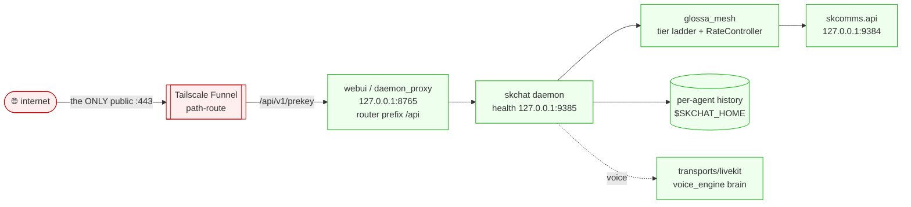

# skchat — Standard Operating Procedures

AI-native end-to-end-encrypted chat (text/voice/files between humans and AI agents).
A single Python package (`skchat-sovereign`) shipping a CLI, Textual TUI, Web UI, systemd
daemon, and MCP server. Sits on **skcomms** (transport/envelopes) and **capauth** (identity).

## 1. Overview

**Owns:** the conversation surface — local per-agent SQLite/JSONL history, the model
picker, the AdvocacyEngine `@mention` routing into the skcapstone consciousness loop,
the webui + daemon, the device hybrid-KEM prekey exchange, the **SKGlossa** codec/rate
mesh (tier ladder + runtime rate adaptation), and the engine-backed **LiveKit** voice
transport.

**Does NOT do:** the envelope/signing protocol (skcomms) or the identity root (capauth).

### 1a. Subsystems (merged tree)

- **Per-agent store (`SKCHAT_HOME`).** `ChatHistory` resolves its JSONL + memory-store
  paths from `SKCHAT_HOME` (via `_skchat_home()`), defaulting to `~/.skchat`. Two agent
  daemons/webuis on one box no longer co-mingle a single store — an `opus` daemon +
  webui run with `SKCHAT_HOME=~/.skchat-opus`, isolated from lumina's `~/.skchat`.
  Single-agent behaviour is unchanged. `SKCHAT_ADVOCACY_DISABLED` lets an external
  responder own replies without the built-in engine double-answering.
- **SKGlossa mesh (`glossa_mesh/`).** A codec/rate layer above skcomms' L0/L1/L2 frame
  ladder (skcomms stays unmodified). **G2** adds `rate.RateController` — an adaptive
  tier selector with asymmetric hysteresis (degrade fast toward the robust L0 floor,
  upgrade slowly) that only ever *proposes* a tier; `level(ceiling)` clamps it into
  `[floor, ceiling]` so it can never exceed handshake-negotiated limits. **L3**
  (`tokenstream.py`, re-exported via `codec_ext.py`) is a strictly-additive tier that
  streams a Message as ordered CBOR tokens (`INTENT · ARG* · REF* · TEXT* · END`) so a
  receiver can begin glossing before the full frame arrives; round-trip invariant
  `decode_l3(encode_l3(m)) == m`. Tier-negotiated — a peer without L3 stays on the
  prior tier (never an undecodable frame). This is codec/rate, **not** crypto.
- **Engine-backed LiveKit transport (`transports/livekit.py`).** Re-homes the
  lumina-call agent onto the unified `voice_engine` brain (persona · memory · routing ·
  LLM · tools · STT/TTS). The transport owns the room/turn loop — per-participant energy
  VAD, barge-in, the addressing gate, the roundtable turn-cap — pushing PCM into a
  LiveKit `LocalAudioTrack`. Decision logic (`VADSegmenter`, `BargeInDetector`,
  `AddressingGate`) is factored into pure injectable-clock classes, unit-tested without a
  live room. `livekit` is a **soft dependency** — importing the module never requires the
  RTC SDK (only `run_agent` / `build_room_session` do).

## 2. Architecture

A message is composed locally, persisted to the per-agent store (`$SKCHAT_HOME`),
PGP-signed/encrypted, framed by the SKGlossa tier the link negotiated (with runtime
rate adaptation inside that ceiling), and handed to skcomms for delivery. The public
surface is the device prekey exchange only; all chat bytes ride skcomms federation.
Voice legs run through the engine-backed LiveKit transport.

## 3. Build

`python -m venv ~/.skenv && ~/.skenv/bin/pip install -e .` Voice/video legs talk to
SKVoice (`127.0.0.1:18800`), STT/TTS, and the LLM at `127.0.0.1:11434` — all tailnet/local.

## 4. Test

`pytest` — unit + integration (crypto, prekey, daemon, history, per-agent store,
`test_glossa_rate` / `test_glossa_tokenstream` for G2, `test_transport_livekit` for the
voice transport). Green bar gates release. Some suites need optional deps
(skcomms/fastapi/`audioop`); the codec/rate/transport/store tests are pure-Python and
run without them.

## 5. Release / Deploy

> ⚠️ **Do NOT `git push` skchat — pushing auto-publishes to PyPI.** Commit **locally only**;
> a maintainer cuts releases deliberately.

Library/service: bump `version`, dated `CHANGELOG.md` entry, run the gate, commit locally.
Service runs as a `systemd` user unit: the daemon (health `:9385`) + `skchat webui` (`:8765`).

### Front-end / Exposure

Per [sk-standards `UNIFIED_INGRESS_STANDARD.md`](https://github.com/smilinTux/sk-standards/blob/main/standards/UNIFIED_INGRESS_STANDARD.md):

- **Tier:** `0 Direct (Funnel :443 path-route)`. Single node, the prekey endpoint mounted
  straight onto Tailscale Funnel — no reverse proxy.
- **Public `:443` route(s)** (webui/`daemon_proxy`, router prefix `/api`):
  - `GET /api/v1/prekey/{peer}` — fetch a peer's hybrid-KEM prekey bundle (`lumina` returns
    Lumina's own on-demand bundle).
  - `POST /api/v1/prekey` — publish the app/device prekey bundle.
- **Bind address:**
  - webui / daemon-proxy: `127.0.0.1:8765` (`SKCHAT_HOST`, default `127.0.0.1`).
  - daemon health server: `127.0.0.1:9385` (opus) / `:9389` (jarvis) — `SKCHAT_HEALTH_HOST`
    default `127.0.0.1`, **local-only, not Funnel-exposed**.
  - **Never an internet-exposed port** — Funnel is the sole ingress.

## 6. Configuration / Usage

`SKCHAT_HOST`, `SKCHAT_PORT` (8765), `SKCHAT_HEALTH_HOST`/`SKCHAT_HEALTH_PORT` (9385).
Talks to `skcomms.api` at `127.0.0.1:9384`. Model picker switches the routed LLM.

## 7. API / Reference

Webui FastAPI (`daemon_proxy` router, prefix `/api`): `GET /api/health`,
`POST /api/v1/prekey`, `GET /api/v1/prekey/{peer}`. MCP tools: send/receive/react/call/
transfer. CLI: `skchat webui`, `skchat daemon`, `skchat conf`.

## 8. Troubleshooting

| Symptom | Check |
|---|---|
| "daemon offline" in webui | stale service worker / persisted `/api` base; clear site data; origin-relative base |
| prekey fetch fails | peer published a bundle? `lumina` bundle generated on demand |
| health bind error | port `9385`/`9389` already taken; daemon continues without health endpoint |

## 9. Maturity-tier + Version reference

Crypto component. Hybrid-KEM device prekeys `HKDF(X25519 ‖ MLKEM768)`; per-message
sign/encrypt via skcomms — see
[CRYPTOGRAPHY_STANDARD.md](https://github.com/smilinTux/sk-standards/blob/main/standards/CRYPTOGRAPHY_STANDARD.md).
The crypto surface lives in **capauth** (identity/keys) and **skcomms** (envelope
sign/encrypt); skchat consumes it. The SKGlossa G2 additions (RateController +
L3 token-stream) are **codec/rate**, not crypto — they change framing and tier
selection, never key exchange, signing, or cipher choice, and each tier stays gated
behind the same handshake negotiation (no new undecryptable-frame path). The per-agent
`SKCHAT_HOME` store is filesystem isolation, likewise crypto-neutral.
VERSION_LIFECYCLE: Active v2. SemVer per `pyproject.toml`. See `CHANGELOG.md`.
