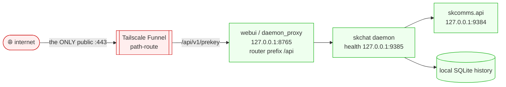

# skchat — Standard Operating Procedures

AI-native end-to-end-encrypted chat (text/voice/files between humans and AI agents).
A single Python package (`skchat-sovereign`) shipping a CLI, Textual TUI, Web UI, systemd
daemon, and MCP server. Sits on **skcomms** (transport/envelopes) and **capauth** (identity).

## 1. Overview

**Owns:** the conversation surface — local SQLite history, the model picker, the
AdvocacyEngine `@mention` routing into the skcapstone consciousness loop, the webui +
daemon, and the device hybrid-KEM prekey exchange.

**Does NOT do:** the envelope/signing protocol (skcomms) or the identity root (capauth).

## 2. Architecture

A message is composed locally, persisted to SQLite, PGP-signed/encrypted, and handed to
skcomms for delivery. The public surface is the device prekey exchange only; all chat
bytes ride skcomms federation.

## 3. Build

`python -m venv ~/.skenv && ~/.skenv/bin/pip install -e .` Voice/video legs talk to
SKVoice (`127.0.0.1:18800`), STT/TTS, and the LLM at `127.0.0.1:11434` — all tailnet/local.

## 4. Test

`pytest` — unit + integration (crypto, prekey, daemon, history). Green bar gates release.

## 5. Release / Deploy

> ⚠️ **Do NOT `git push` skchat — pushing auto-publishes to PyPI.** Commit **locally only**;
> a maintainer cuts releases deliberately.

Library/service: bump `version`, dated `CHANGELOG.md` entry, run the gate, commit locally.
Service runs as a `systemd` user unit: the daemon (health `:9385`) + `skchat webui` (`:8765`).

### Front-end / Exposure

Per [sk-standards `UNIFIED_INGRESS_STANDARD.md`](https://github.com/smilinTux/sk-standards/blob/main/standards/UNIFIED_INGRESS_STANDARD.md):

- **Tier:** `0 Direct (Funnel :443 path-route)`. Single node, the prekey endpoint mounted
  straight onto Tailscale Funnel — no reverse proxy.
- **Public `:443` route(s)** (webui/`daemon_proxy`, router prefix `/api`):
  - `GET /api/v1/prekey/{peer}` — fetch a peer's hybrid-KEM prekey bundle (`lumina` returns
    Lumina's own on-demand bundle).
  - `POST /api/v1/prekey` — publish the app/device prekey bundle.
- **Bind address:**
  - webui / daemon-proxy: `127.0.0.1:8765` (`SKCHAT_HOST`, default `127.0.0.1`).
  - daemon health server: `127.0.0.1:9385` (opus) / `:9389` (jarvis) — `SKCHAT_HEALTH_HOST`
    default `127.0.0.1`, **local-only, not Funnel-exposed**.
  - **Never an internet-exposed port** — Funnel is the sole ingress.

## 6. Configuration / Usage

`SKCHAT_HOST`, `SKCHAT_PORT` (8765), `SKCHAT_HEALTH_HOST`/`SKCHAT_HEALTH_PORT` (9385).
Talks to `skcomms.api` at `127.0.0.1:9384`. Model picker switches the routed LLM.

## 7. API / Reference

Webui FastAPI (`daemon_proxy` router, prefix `/api`): `GET /api/health`,
`POST /api/v1/prekey`, `GET /api/v1/prekey/{peer}`. MCP tools: send/receive/react/call/
transfer. CLI: `skchat webui`, `skchat daemon`, `skchat conf`.

## 8. Troubleshooting

| Symptom | Check |
|---|---|
| "daemon offline" in webui | stale service worker / persisted `/api` base; clear site data; origin-relative base |
| prekey fetch fails | peer published a bundle? `lumina` bundle generated on demand |
| health bind error | port `9385`/`9389` already taken; daemon continues without health endpoint |

## 9. Maturity-tier + Version reference

Crypto component. Hybrid-KEM device prekeys `HKDF(X25519 ‖ MLKEM768)`; per-message
sign/encrypt via skcomms — see
[CRYPTOGRAPHY_STANDARD.md](https://github.com/smilinTux/sk-standards/blob/main/standards/CRYPTOGRAPHY_STANDARD.md).
VERSION_LIFECYCLE: Active v2. SemVer per `pyproject.toml`.
