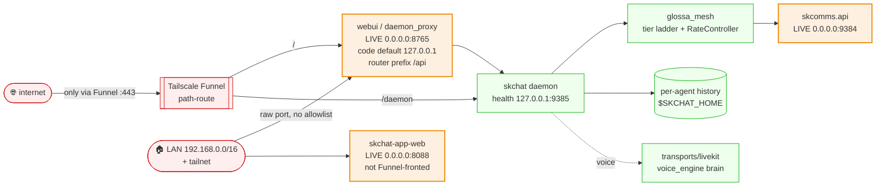

# skchat — Standard Operating Procedures

AI-native end-to-end-encrypted chat (text/voice/files between humans and AI agents).
A single Python package (`skchat-sovereign`) shipping a CLI, Textual TUI, Web UI, systemd
daemon, and MCP server. Sits on **skcomms** (transport/envelopes) and **capauth** (identity).

## 1. Overview

**Owns:** the conversation surface — local per-agent SQLite/JSONL history, the model
picker, the AdvocacyEngine `@mention` routing into the skcapstone consciousness loop,
the webui + daemon, the device hybrid-KEM prekey exchange, the **SKGlossa** codec/rate
mesh (tier ladder + runtime rate adaptation), and the engine-backed **LiveKit** voice
transport.

**Does NOT do:** the envelope/signing protocol (skcomms) or the identity root (capauth).

### 1a. Subsystems (merged tree)

- **Per-agent store (`SKCHAT_HOME`).** `ChatHistory` resolves its JSONL + memory-store
  paths from `SKCHAT_HOME` (via `_skchat_home()`), defaulting to `~/.skchat`. Two agent
  daemons/webuis on one box no longer co-mingle a single store — an `opus` daemon +
  webui run with `SKCHAT_HOME=~/.skchat-opus`, isolated from lumina's `~/.skchat`.
  Single-agent behaviour is unchanged. `SKCHAT_ADVOCACY_DISABLED` lets an external
  responder own replies without the built-in engine double-answering.
- **SKGlossa mesh (`glossa_mesh/`).** A codec/rate layer above skcomms' L0/L1/L2 frame
  ladder (skcomms stays unmodified). **G2** adds `rate.RateController` — an adaptive
  tier selector with asymmetric hysteresis (degrade fast toward the robust L0 floor,
  upgrade slowly) that only ever *proposes* a tier; `level(ceiling)` clamps it into
  `[floor, ceiling]` so it can never exceed handshake-negotiated limits. **L3**
  (`tokenstream.py`, re-exported via `codec_ext.py`) is a strictly-additive tier that
  streams a Message as ordered CBOR tokens (`INTENT · ARG* · REF* · TEXT* · END`) so a
  receiver can begin glossing before the full frame arrives; round-trip invariant
  `decode_l3(encode_l3(m)) == m`. Tier-negotiated — a peer without L3 stays on the
  prior tier (never an undecodable frame). This is codec/rate, **not** crypto.
- **Engine-backed LiveKit transport (`transports/livekit.py`).** Re-homes the
  lumina-call agent onto the unified `voice_engine` brain (persona · memory · routing ·
  LLM · tools · STT/TTS). The transport owns the room/turn loop — per-participant energy
  VAD, barge-in, the addressing gate, the roundtable turn-cap — pushing PCM into a
  LiveKit `LocalAudioTrack`. Decision logic (`VADSegmenter`, `BargeInDetector`,
  `AddressingGate`) is factored into pure injectable-clock classes, unit-tested without a
  live room. `livekit` is a **soft dependency** — importing the module never requires the
  RTC SDK (only `run_agent` / `build_room_session` do).

## 2. Architecture

```mermaid
flowchart LR
    NET([🌐 internet]) -->|"only via Funnel :443"| FUNNEL[["Tailscale Funnel<br/>path-route"]]
    LAN([🏠 LAN 192.168.0.0/16<br/>+ tailnet]) -->|"raw port, no allowlist"| WEBUI
    FUNNEL -->|"/"| WEBUI[webui / daemon_proxy<br/>LIVE 0.0.0.0:8765<br/>code default 127.0.0.1<br/>router prefix /api]
    FUNNEL -->|"/daemon"| DAEMON
    LAN --> APPWEB[skchat-app-web<br/>LIVE 0.0.0.0:8088<br/>not Funnel-fronted]
    WEBUI --> DAEMON[skchat daemon<br/>health 127.0.0.1:9385]
    DAEMON --> GLOSSA[glossa_mesh<br/>tier ladder + RateController]
    GLOSSA --> SKCOMMS[skcomms.api<br/>LIVE 0.0.0.0:9384]
    DAEMON --> HIST[("per-agent history<br/>$SKCHAT_HOME")]
    DAEMON -.voice.-> LK[transports/livekit<br/>voice_engine brain]
    classDef pub fill:#fee,stroke:#c00;
    classDef drift fill:#fef0e0,stroke:#e80,stroke-width:2px;
    classDef priv fill:#efe,stroke:#0a0;
    class NET,FUNNEL,LAN pub
    class WEBUI,APPWEB,SKCOMMS drift
    class DAEMON,GLOSSA,HIST,LK priv
```

Orange nodes are **bind-address drift**: the code default is loopback, the deployment
overrode it. See section 5 for the measured scope.

A message is composed locally, persisted to the per-agent store (`$SKCHAT_HOME`),
PGP-signed/encrypted, framed by the SKGlossa tier the link negotiated (with runtime
rate adaptation inside that ceiling), and handed to skcomms for delivery. The public
surface is the device prekey exchange only; all chat bytes ride skcomms federation.
Voice legs run through the engine-backed LiveKit transport.

## 3. Build

`python -m venv ~/.skenv && ~/.skenv/bin/pip install -e .` Voice/video legs talk to
SKVoice (`127.0.0.1:18800`), STT/TTS, and the LLM at `127.0.0.1:11434` — all tailnet/local.

## 4. Test

`pytest` — unit + integration (crypto, prekey, daemon, history, per-agent store,
`test_glossa_rate` / `test_glossa_tokenstream` for G2, `test_transport_livekit` for the
voice transport). Green bar gates release. Some suites need optional deps
(skcomms/fastapi/`audioop`); the codec/rate/transport/store tests are pure-Python and
run without them.

## 5. Release / Deploy

> ⚠️ **Do NOT `git push` skchat — pushing auto-publishes to PyPI.** Commit **locally only**;
> a maintainer cuts releases deliberately.

Library/service: add a dated `CHANGELOG.md` entry, run the gate, commit locally. **There
is no `version` field to bump**, `pyproject.toml` is `dynamic = ["version"]` and
setuptools-scm derives it from the newest release tag (section 9). Service runs as
`systemd` user units: the daemon (health `:9385`), `skchat-webui@<agent>` (`:8765` for
lumina, `:8766` for opus), and `skchat-app-web` (`:8088`).

### Front-end / Exposure

Per [sk-standards `UNIFIED_INGRESS_STANDARD.md`](https://github.com/smilinTux/sk-standards/blob/main/standards/UNIFIED_INGRESS_STANDARD.md):

- **Tier:** `0 Direct (Funnel :443 path-route)`. Single node, mounted straight onto
  Tailscale Funnel, no reverse proxy.
- **Public `:443` routes.** Funnel does **not** mount two prekey paths as an earlier
  revision of this section implied. Verified 2026-08-15 with `tailscale funnel status`,
  it proxies whole subtrees:

  | Funnel path | Proxied to | Effect |
  |---|---|---|
  | `/` | `http://localhost:8765` | **the entire webui**, including `/api/v1/prekey*` |
  | `/daemon` | `http://127.0.0.1:9385` | the daemon health server |
  | `/livekit-ws` | `http://100.108.59.57:7880` | LiveKit signaling |
  | `/.well-known/skfed/directory` | `http://localhost:9384` | skcomms directory (skcomms' route) |

  Funnel also forwards raw TCP `:8443` and `:10000` onto `localhost:443`.

#### Bind addresses: CODE DEFAULT vs WHAT `.158` ACTUALLY RUNS

> ⚠️ **An earlier revision of this section declared the webui binds `127.0.0.1:8765` and
> that skchat is "never an internet-exposed port". That was the code default written as
> if it described the deployment, and it was false of the running service.** Verified
> 2026-08-15 with `ss -tlnp`.

| Surface | Code default | Live on `.158` (2026-08-15) | Verdict |
|---|---|---|---|
| webui / daemon-proxy `:8765` (lumina) | `127.0.0.1` (`webui.py` `SKCHAT_HOST` default) | **`0.0.0.0:8765`** | ❌ **DRIFTED** |
| webui / daemon-proxy `:8766` (opus) | same | **`0.0.0.0:8766`** | ❌ **DRIFTED + previously undeclared** |
| daemon health `:9385` | `127.0.0.1` (`daemon.py` `SKCHAT_HEALTH_HOST` default) | `127.0.0.1:9385` | ✅ bind correct (but see the Funnel note) |
| `skchat-app-web` `:8088` | `127.0.0.1` (`scripts/serve-app-web.sh` `BIND` default) | **`0.0.0.0:8088`** | ❌ **deliberate, but previously undeclared** |

**How `:8765` drifted.** The code is right (`webui.py`:
`os.environ.get("SKCHAT_HOST", "127.0.0.1")`). The deployment overrides it:
`~/.config/skchat/webui-lumina.env` and `webui-opus.env` set `SKCHAT_HOST=0.0.0.0`, read
by `skchat-webui@.service` via `EnvironmentFile=`. Two agent instances run, lumina on
`:8765` and opus on `:8766` (`SKCHAT_HOME=~/.skchat-opus`).

**`:8088` is different: it is deliberate, not accidental.** `scripts/serve-app-web.sh`
defaults `BIND` to `127.0.0.1`, and the shipped unit
`systemd/units/skchat-app-web.service` overrides it with
`Environment=SKCHAT_APP_WEB_BIND=0.0.0.0` on purpose, because the Flutter web client is
reached directly on the tailnet/LAN and is **not** Funnel-fronted (`:8088` is not in the
Tailscale ingress map). The unit's own comment names "loopback bind plus a funnel
mapping" as a security follow-up. It belongs in this section either way: an undeclared
`0.0.0.0` listener is a documentation defect even when the bind is intentional.

**Scope the exposure correctly. These are two different things:**

1. **Raw-port reachability (the drift).** `0.0.0.0` means the **LAN `192.168.0.0/16`
   plus the tailnet**, not the internet. This host has no public interface; Funnel
   publishes only `:443`/`:8443`/`:10000`. `curl http://192.168.0.158:8765/` returns
   `307` and `http://192.168.0.158:8088/` returns `200` from the LAN.
2. **Funnel reachability (by design, and unchanged by the drift).** Funnel proxies `/`
   to `localhost:8765`, so **`:8765` IS reachable from the internet** and always was.
   That is intended: it is how the web client is served. It arrives **through the Funnel
   path**, terminating TLS at Funnel with a Tailscale-issued certificate, and **not** on
   the raw port. The drift did not create internet exposure for 8765; it created
   **LAN/tailnet** exposure that bypasses Funnel.

   The same applies to the daemon health server on `:9385`: its **bind is correct**
   (`127.0.0.1`), but the earlier claim that it is "**not** Funnel-exposed" was **wrong**
   in the other direction. Funnel proxies `/daemon` straight to it. Loopback-bound does
   not mean unreachable when a Funnel path points at loopback.

**Remediation (not applied here, needs an operator pass).** For `:8765`/`:8766`, drop
`SKCHAT_HOST=0.0.0.0` from `~/.config/skchat/webui-*.env` so the loopback default takes
effect, and let Funnel's `/` mount carry the traffic; confirm with
`ss -tlnp | grep 876`. For `:8088`, the unit's own noted follow-up (loopback bind plus a
Funnel mapping) applies.

## 6. Configuration / Usage

| Variable | Code default | Notes |
|---|---|---|
| `SKCHAT_HOST` | `127.0.0.1` | ⚠️ `.158` sets `0.0.0.0` in `~/.config/skchat/webui-*.env`, see section 5 |
| `SKCHAT_PORT` | `8765` | `:8766` for the second (opus) instance |
| `SKCHAT_HEALTH_HOST` | `127.0.0.1` | matches the live bind |
| `SKCHAT_HEALTH_PORT` | `9385` | `:9389` for jarvis |
| `SKCHAT_HOME` | `~/.skchat` | per-agent store; opus runs `~/.skchat-opus` |
| `SKCHAT_APP_WEB_BIND` / `_PORT` | `127.0.0.1` / `8088` | the shipped unit overrides the bind to `0.0.0.0` on purpose |

Talks to `skcomms.api` on `:9384`. That socket is **also** drift-exposed on `0.0.0.0`;
it is skcomms' surface, tracked in
[skcomms SOP.md §5](https://github.com/smilinTux/skcomms/blob/main/SOP.md), not here.
Model picker switches the routed LLM.

Entry points (`pyproject.toml` `[project.scripts]`): `skchat`, `skchat-mcp`,
`skchat-voice`.

## 7. API / Reference

Webui FastAPI (`daemon_proxy` router, prefix `/api`): `GET /api/health`,
`POST /api/v1/prekey`, `GET /api/v1/prekey/{peer}`. MCP tools: send/receive/react/call/
transfer. CLI: `skchat webui`, `skchat daemon`, `skchat conf`. Crypto self-report:
`skchat pqc report` (and the top-level alias `skchat pqc-report`).

## 8. Troubleshooting

| Symptom | Check |
|---|---|
| "daemon offline" in webui | stale service worker / persisted `/api` base; clear site data; origin-relative base |
| prekey fetch fails | peer published a bundle? `lumina` bundle generated on demand |
| health bind error | port `9385`/`9389` already taken; daemon continues without health endpoint |
| webui answering on the LAN when you expected loopback | `SKCHAT_HOST=0.0.0.0` in `~/.config/skchat/webui-*.env` overrides the `127.0.0.1` code default. Not a code bug, see section 5 |
| two webui instances, `:8765` and `:8766` | by design: lumina and opus, isolated by `SKCHAT_HOME`. `ss -tlnp \| grep 876` shows both |
| `:8088` serving the Flutter client to the whole LAN | deliberate: `skchat-app-web.service` sets `SKCHAT_APP_WEB_BIND=0.0.0.0` because `:8088` is not Funnel-fronted. Section 5 |

## 9. Maturity-tier + Version reference

> ⚠️ **Experimental, pre-1.0, NOT independently security-audited.** No third-party
> security audit, fuzzing, or formal review has been performed on skchat. skchat does not
> implement KEM or signature primitives: it binds vetted ones (`skcomms.pqkem` for
> X25519 + ML-KEM-768, capauth/PGPy for signing, `cryptography` for AES-GCM/HKDF). The
> original code here is the **composition**, which is where protocol bugs live: prekey
> publish/fetch, the DM epoch ratchet, group key distribution and rotation, the at-rest
> DEK wrap, and the glossa gatekeeper's source-authentication. A passing test suite
> proves interop and behaviour, **not** the absence of side channels or protocol flaws.
> **Review it yourself before production use.**

### Maturity tier

skchat is a **crypto component** whose primitives are **consumed, not owned**. Identity
and signing come from [capauth](https://github.com/smilinTux/capauth); envelope
sign/encrypt and the hybrid-KEM primitive come from
[skcomms](https://github.com/smilinTux/skcomms). What skchat owns is the key *lifecycle*
on its own surfaces: device prekeys, DM epoch secrets, group keys, and at-rest DEKs.
Tiers below are per the sk-standards
[CRYPTOGRAPHY_STANDARD.md](https://github.com/smilinTux/sk-standards/blob/main/standards/CRYPTOGRAPHY_STANDARD.md)
ladder, and are claimed **only for the surfaces skchat owns**.

**Declared tier: T1 + T2 on skchat-owned surfaces. T3 not claimed. T4 not claimed.**

- **T1, Agile: DONE.** Machine-readable suite ids on every container skchat writes:
  `ChatMessage.metadata["kem_suite"]` (`crypto.py`), `SKGroup.kem_suite` (`group.py`),
  and a `suite_id` string embedded in the at-rest blob header (`atrest_wrap.py`). Runtime
  self-report: `skchat pqc report`, plus `GroupChat.crypto_self_report()` and
  `EncryptedChatHistory.crypto_self_report()`. The suite registry and backend live in
  skcomms.
- **T2, Hybrid KEM: DEFAULT on new objects.** `x25519-mlkem768`, that is
  `HKDF(X25519 ‖ ML-KEM-768)` (FIPS 203), concatenate-then-KDF. Hybrid is secure if
  **either** leg holds. Pinned in code at `dm_ratchet.py` `HYBRID_KEM_SUITE`,
  `pq_prekeys.py` `HYBRID_SUITE`, `group.py` `DEFAULT_NEW_KEM_SUITE`, and
  `atrest_wrap.py` `DEFAULT_SUITE_ID`. Covers device prekeys, the 1:1 DM ratchet,
  newly-created groups (hybrid from epoch 1 for every member holding a hybrid prekey),
  and the at-rest DEK wrap. **HNDL is neutralised only on those legs.** Documented
  exceptions, all real:
  - **Legacy groups stay classical.** A group created before the cut-over, or with a
    member lacking a hybrid prekey, keeps `kem_suite="rsa-pgp-wrap-v1"` until migrated
    with `skchat pqc migrate-fleet`. The field default in `group.py` is deliberately
    still classical so pre-cut-over objects deserialize and self-report honestly; the
    cut-over lives at the `create()` factory, never in deserialization.
  - **The browser / Flutter-web leg is reduced-assurance.** WebCrypto exposes no PQC
    API, so the web PWA cannot do hybrid. Native clients get it via liboqs FFI. No web
    client may claim end-to-end post-quantum (`docs/crypto-architecture.md` §7).
- **T3, Hybrid sig: NOT CLAIMED.** Identity, envelope, and glossa source-authentication
  signatures are classical Ed25519/RSA via capauth/PGP. skcomms has the
  `mldsa65-ed25519-v2` suite (FIPS 204) wired but not defaulted, and skchat inherits that
  default. Signatures are therefore **classically forgeable post-quantum**: a
  future-forgery risk, deferrable, **not** HNDL. Do not describe the signature surface as
  quantum-resistant.
- **T4, Transport-closed: NOT CLAIMED.** LiveKit DTLS-SRTP (voice, video, data channel)
  and the Funnel / CF-to-origin TLS legs are classical. The `:8765`, `:8766` and `:8088`
  sockets are additionally LAN-exposed (section 5). No end-to-end quantum-resistant claim
  spans these legs.
- **Symmetric/hash floor:** AES-256-GCM bulk (`group.py`, `encrypted_store.py`) and
  SHA-256 / HKDF-SHA256 integrity are quantum-acceptable (Grover-only, at least 128-bit).
  **AES-256 is not broken by quantum.**

**Not crypto (do not count these toward a tier).** The SKGlossa G2 additions
(`RateController` + the L3 token-stream) are **codec/rate**: they change framing and tier
selection, never key exchange, signing, or cipher choice, and each tier stays gated
behind the same handshake negotiation, so there is no new undecryptable-frame path. The
per-agent `SKCHAT_HOME` store is filesystem isolation, likewise crypto-neutral.

**Every claim above must be checkable at runtime, not just here:** `skchat pqc report`
is the self-report of record, and it reports per surface rather than blanket.

### Version

VERSION_LIFECYCLE phase: **Active** (pre-1.0 `0.x`; only the latest published `0.x` line
gets security fixes). There is **no** SemVer literal in `pyproject.toml` to quote:
it declares `dynamic = ["version"]` and `[tool.setuptools_scm]` derives the version from
the newest release git tag, writing it to `src/skchat/_version.py` at build time. Read
the real value with `python -c "import skchat._version as v; print(v.version)"` or
`git describe --tags --match 'v[0-9]*'`. See `CHANGELOG.md`.

---

## Verification notes for this document

The section 5 bind table, the Funnel path table, and the two-instance detail came from
the live node on 2026-08-15 (`ss -tlnp`, `systemctl --user show`,
`tailscale funnel status`, `/proc/<pid>/environ`, `curl`), not from the previous revision
of this file. Live facts cannot be re-checked by CI, so the `docs-evidence` block below
pins the **repo-local** halves: the code defaults this document names, the shipped unit's
deliberate `0.0.0.0` override, the suite ids that back every T2 claim in section 9, the
entry points, and the fact that the CI test job can still fail.

<!-- docs-evidence
verified: 2026-08-15
checks:
  - name: webui host default is still 127.0.0.1 (section 5 documents this as the CODE default the deployment overrides)
    run: grep -qF 'os.environ.get("SKCHAT_HOST", "127.0.0.1")' src/skchat/webui.py
  - name: daemon health host and port defaults unchanged (127.0.0.1:9385)
    run: grep -qF '_os.environ.get("SKCHAT_HEALTH_HOST", "127.0.0.1")' src/skchat/daemon.py && grep -qxF '        self, port: int = int(os.environ.get("SKCHAT_HEALTH_PORT") or 9385)' src/skchat/daemon.py
  - name: all three console entry points unchanged
    run: grep -qxF 'skchat = "skchat.cli:main"' pyproject.toml && grep -qxF 'skchat-mcp = "skchat.mcp_server:main"' pyproject.toml && grep -qxF 'skchat-voice = "skchat.transports.serve_ws:main"' pyproject.toml
  - name: app-web unit still deliberately binds 0.0.0.0:8088 (the undeclared surface section 5 now declares)
    run: grep -qxF 'Environment=SKCHAT_APP_WEB_BIND=0.0.0.0' systemd/units/skchat-app-web.service && grep -qxF 'Environment=SKCHAT_APP_WEB_PORT=8088' systemd/units/skchat-app-web.service
  - name: app-web script bind default is still loopback (section 5 contrasts it with the unit)
    run: grep -qxF 'BIND="${SKCHAT_APP_WEB_BIND:-127.0.0.1}"' scripts/serve-app-web.sh
  - name: T2 hybrid-KEM suite id is still x25519-mlkem768 on every surface section 9 claims
    run: grep -qxF 'HYBRID_KEM_SUITE = "x25519-mlkem768"' src/skchat/dm_ratchet.py && grep -qxF 'HYBRID_SUITE = "x25519-mlkem768"' src/skchat/pq_prekeys.py && grep -qxF '    DEFAULT_NEW_KEM_SUITE: ClassVar[str] = "x25519-mlkem768"' src/skchat/group.py
  - name: legacy groups still deserialize as classical (the documented T2 exception)
    run: grep -qxF '    kem_suite: str = "rsa-pgp-wrap-v1"' src/skchat/group.py
  - name: crypto self-report commands still exist (no claim without evidence)
    run: grep -qxF '@pqc.command(name="report")' src/skchat/cli.py && grep -qxF '@main.command(name="pqc-report")' src/skchat/cli.py
  - name: CI test job still runs pytest with the documented marker exclusion and is not neutered by a trailing true
    run: grep -qF 'not live and not integration and not e2e_live and not e2e_3way' .github/workflows/ci.yml && ! grep -qE '\|\|[[:space:]]*true' .github/workflows/ci.yml
  - name: version is setuptools-scm derived, with no SemVer literal to go stale
    run: grep -qxF 'dynamic = ["version"]' pyproject.toml && grep -qxF '[tool.setuptools_scm]' pyproject.toml && ! grep -qE '^version[[:space:]]*=' pyproject.toml
-->
