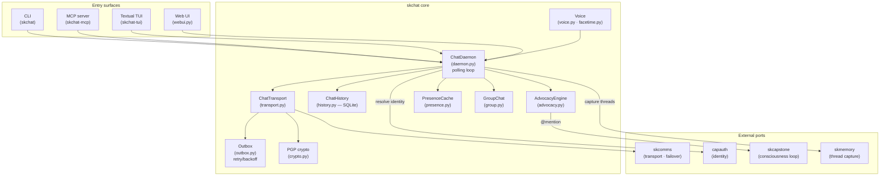
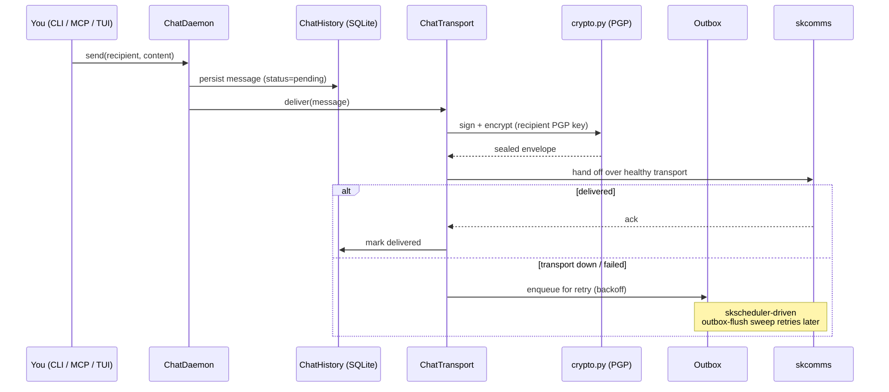
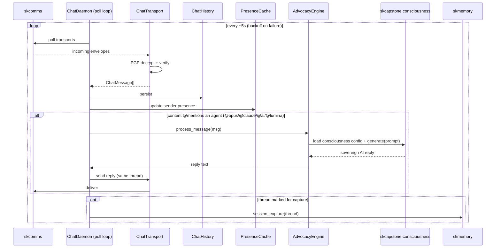
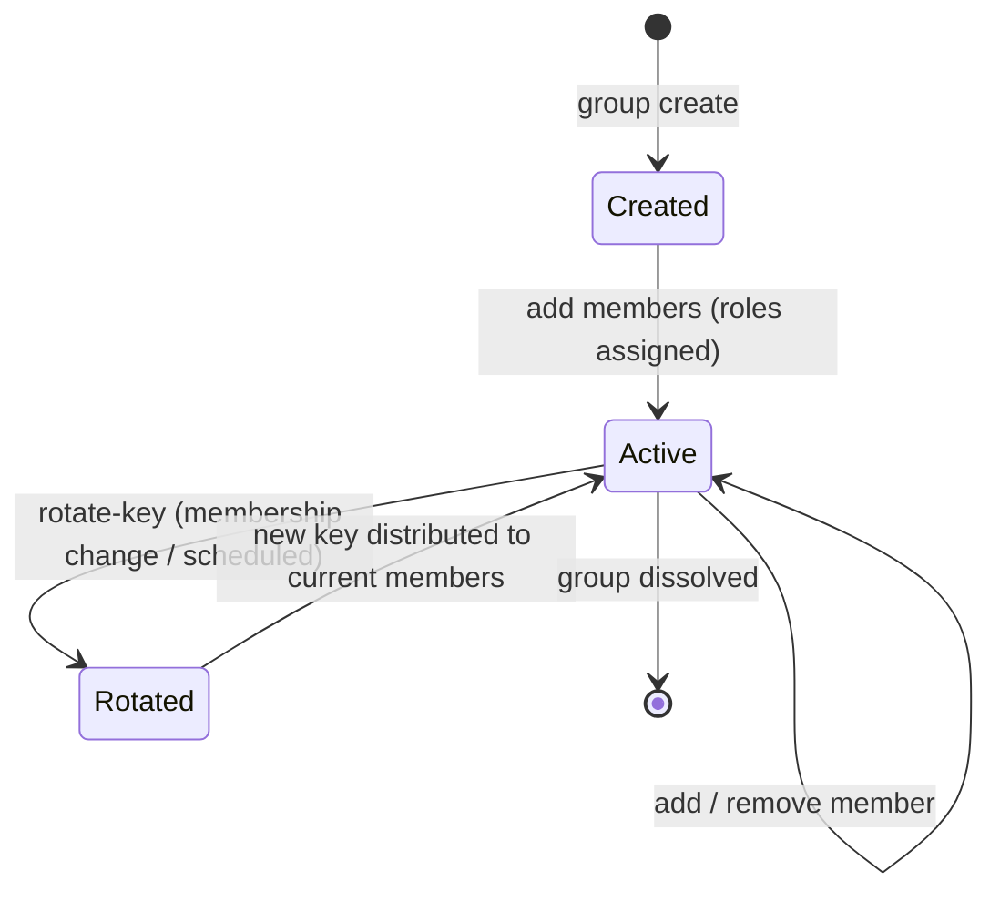
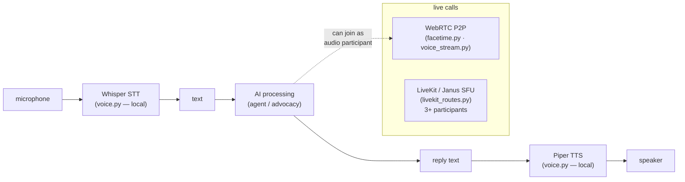
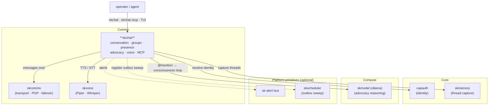

# skchat — Architecture

skchat is the **conversation surface** of SKWorld: a single Python package
(`skchat-sovereign`) that lets humans and AI agents exchange text, voice, and
files. It is deliberately *thin* — it owns conversation, presence, advocacy, and
the UIs, and delegates the hard parts (transport, identity, reasoning) to
dedicated `sk*` ports. This document explains how a message moves through the
system, how the `@mention` advocacy loop turns an agent into a participant, and
where each module fits.

---

## 1. System overview

skchat never owns identity or transport: `identity_bridge.py` is a thin delegate
to the canonical `capauth.resolve_agent_identity`, and `transport.py` hands every
encrypted envelope to SKComm. This keeps the package small and lets the rest of
the ecosystem evolve the hard parts independently.

---

## 2. Outbound message lifecycle

A message is composed locally, persisted immediately, then PGP-protected and
handed to SKComm. The local store is the source of truth — delivery is best-effort
with a reliable outbox behind it.

The outbox sweep (`skchat_outbox_flush`) is registered with **skscheduler** when
the optional `skcapstone` backbone is present; standalone, the daemon's own loop
drains it.

---

## 3. Inbound polling + the @mention advocacy loop

The daemon polls SKComm on an interval (default 5 s) with exponential backoff on
consecutive failures. Each received message is decrypted, persisted, and screened
for an `@mention` — the heart of "the AI is in the room."

`should_advocate()` matches the trigger tokens; `_call_consciousness()` imports
`skcapstone.consciousness_config` + `skcapstone.consciousness_loop` and asks the
live agent to answer for itself. The reply is sent back in the **same thread**, so
to the other participant the agent is simply another member of the conversation.

---

## 4. Group chat + key state

Groups are encrypted with a shared group key that can be rotated; roles gate who
may administer the group.

`group.py` owns the `GroupChat` model (members, roles, key); `reactions.py` adds
emoji reactions that any participant — human or AI — can apply to a message.

---

## 5. Voice pipeline (sovereign, local)

Voice is local-first: speech-to-text and text-to-speech run on-device, and live
calls use WebRTC P2P with a LiveKit/Janus SFU only for multi-party.

---

## 6. Source map

| Module | Role |
|---|---|
| `cli.py` | Click CLI (`skchat`) — send/reply/inbox/history/threads/search/export/stats/chat/group/voice/file/react/status/who/presence/peers/tui/webui |
| `mcp_server.py` | FastMCP server (`skchat-mcp`) — exposes the feature set as agent tools |
| `tui.py` | Textual full-screen TUI (`skchat-tui`) |
| `webui.py` | Browser UI + voice-chat server (static assets in `static/`) |
| `daemon.py` | `ChatDaemon` — polling receive loop; spawns advocacy, memory bridge, WebRTC init, attachments |
| `_daemon_entry.py` | Systemd / process entry-point wrapper |
| `watchdog.py` | Daemon watchdog / health monitor |
| `advocacy.py` | `AdvocacyEngine` — `@mention` detection → skcapstone consciousness loop → in-thread reply |
| `transport.py` | `ChatTransport` — send/receive over SKComm |
| `agent_comm.py` | `AgentMessenger` — low-level agent-to-agent send primitives |
| `outbox.py` | SQLite outbox with retry/backoff for reliable delivery |
| `history.py` | `ChatHistory` — persistent SQLite message store |
| `encrypted_store.py` | AES-encrypted local store |
| `ephemeral.py` | Ephemeral (TTL / no-persist) message channels |
| `models.py` | `ChatMessage`, `Group`, `Peer`, content/message types (Pydantic) |
| `group.py` | `GroupChat` — encrypted group messaging, roles, key rotation |
| `reactions.py` | `ReactionStore` — emoji reactions on messages |
| `presence.py` | `PresenceCache` — online/offline tracking |
| `crypto.py` | PGP sign/verify helpers (PGPy) |
| `plugins_skseal.py` | SKSeal encryption plugin |
| `identity_bridge.py` | Thin delegate to canonical `capauth.resolve_agent_identity` (CapAuth ↔ SKComm addresses) |
| `agent_profile.py` | Resolves agent identities from `~/.skcapstone/agents/<agent>/` |
| `peer_discovery.py` | `PeerDiscovery` — loads peers from `~/.skcapstone/peers/` |
| `memory_bridge.py` | Forwards chat threads to skcapstone memory (`session_capture`) |
| `integration.py` | Optional skcapstone backbone — `sk-alert` alerts + `skscheduler` outbox sweep (default-on-by-presence) |
| `voice.py` | Piper TTS + Whisper STT (local) |
| `voice_stream.py`, `voice_backends.py`, `voice_ws_lite.py` | Streaming voice + backend adapters + lite WS signaling |
| `facetime.py`, `livekit_routes.py` | WebRTC P2P calls + LiveKit SFU routes for group calls |
| `lumina_recorder.py`, `lumina_mcp.py` | Lumina-specific recording + MCP helpers |
| `media.py`, `attachments.py`, `files.py` | Media handling, attachment plumbing, file transfer |
| `context.py` | Conversation context assembly for advocacy / capture |
| `rating.py` | Message / image rating helpers |
| `notifications.py` | Desktop notifications (`notify-send`) fallback |
| `plugins.py`, `plugins_builtin.py` | Plugin loader framework + built-in plugins |

---

## 7. Where it lives in the ecosystem

skchat is a **comms** capability. It rides on skcomms for transport, resolves
identity through capauth, gets advocacy reasoning from the skcapstone
consciousness loop (skmodel-backed), captures threads into skmemory, and reuses
two shared platform primitives — `sk-alert` and `skscheduler` — only when the
optional skcapstone backbone is installed.

---

## 8. Storage & runtime

- **Home**: `~/.skchat` (history DB, daemon pid/log) and `~/.skcomm` (transport
  config, outbox).
- **Peers**: `~/.skcapstone/peers/`; agent profiles: `~/.skcapstone/agents/<agent>/`.
- **Daemon**: systemd-managed (`skchat-daemon.service`), `Type=forking`, health
  endpoint on `:9385` (skcomm transport health on `:9384`). Companion units:
  `skchat-webui`, `skchat-lumina-call`, `jarvis-heartbeat`. Never run
  `skchat daemon start` by hand alongside the managed unit — see
  [CLAUDE.md](../CLAUDE.md).

Part of the **[SKWorld](https://skworld.io)** sovereign ecosystem · 🐧 smilinTux
