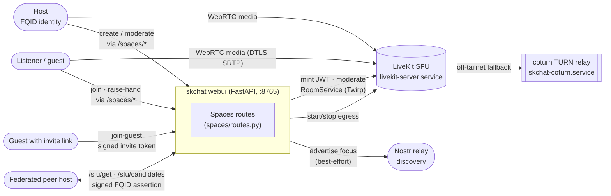
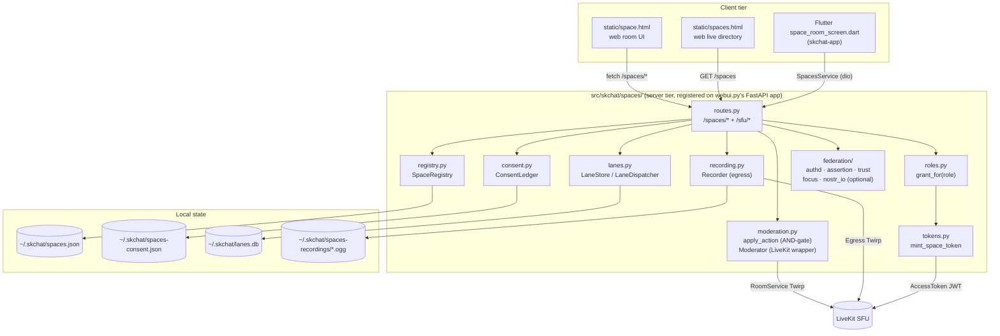
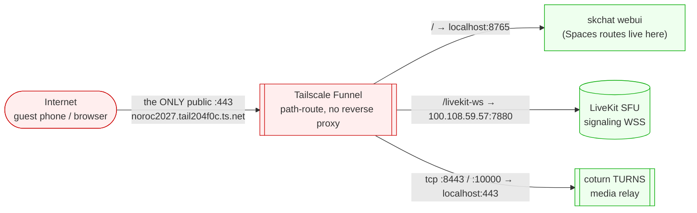
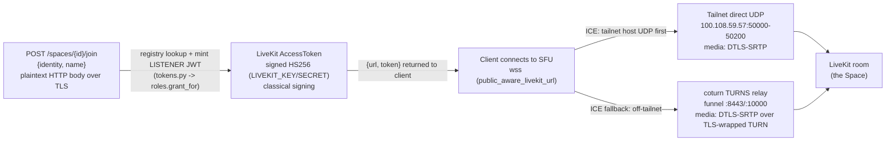
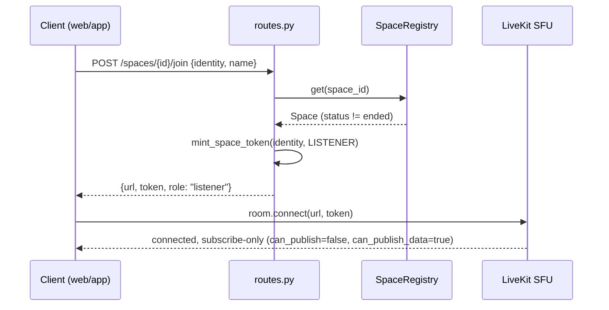
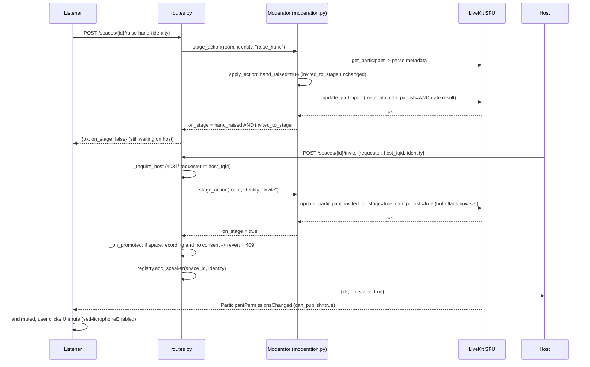
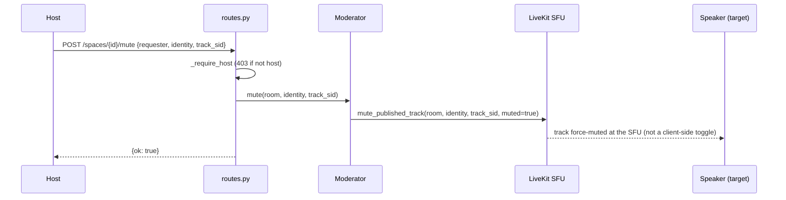
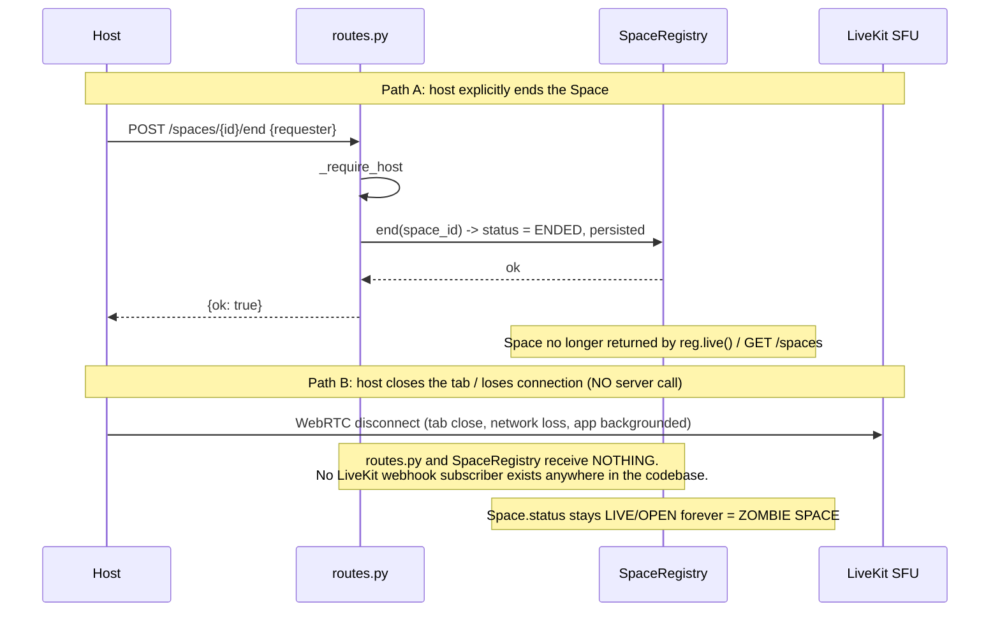

# skchat Spaces: Standard Operating Procedures

Sovereign, X-Spaces-style live audio rooms built on skchat's LiveKit call infrastructure. One host opens a Space, speakers talk over a single sovereign SFU, a large audience listens, and listeners raise a hand for a host-invited mutual-consent promotion to speaker. This document is the canonical reference for what exists today, called out honestly against what is still a gap.

## 1. Overview

**What Spaces is, in two sentences:** Spaces is skchat's live-audio-room feature, a LiveKit (SFU) room per Space with a host/speaker/listener role model, a raise-hand-plus-invite mutual-consent promotion gate, host moderation (mute/remove/kick/end), optional consent-gated recording, and a set of shared data lanes (chat/watch/whiteboard/doc/terminal/screen-share) for the room's back-channel. It ships a web client (`static/space.html` + `static/spaces.html`), a Flutter client (`lib/features/spaces/`), and the server module (`src/skchat/spaces/`).

**Sovereign posture:** every Space runs on a self-hosted LiveKit SFU on the operator's tailnet, no third-party media server. Off-tailnet reach (guests, cellular clients) rides the operator's own coturn TURN relay and the operator's own Tailscale Funnel `:443`, never a SaaS calling product. See §2.8 Connectivity for the exact current posture and its honest limits.

### 1.1 Start here: entry points

| File | This is where |
|---|---|
| `src/skchat/spaces/routes.py` | every `/spaces/*` and `/sfu/*` HTTP route (create, join, moderate, record, end) |
| `src/skchat/spaces/space.py` | the `Space` model + `derive_space_id(host_fqid, slug)` (deterministic room id) |
| `src/skchat/spaces/roles.py` | role-to-LiveKit-grant mapping (`Role.HOST/SPEAKER/LISTENER`, `grant_for()`) |
| `src/skchat/spaces/moderation.py` | the raise-hand/invite AND-gate (`apply_action`) + the `Moderator` LiveKit wrapper (mute/kick/stage transitions) |
| `src/skchat/spaces/registry.py` | the "live now" Space registry, JSON-backed at `~/.skchat/spaces.json` |
| `src/skchat/static/space.html` | the web room UI: join card, control-bar state machine, invited banner, share |
| `lib/features/spaces/space_room_screen.dart` (skchat-app repo) | the Flutter room screen |

**The data it owns:** `Space` records (`~/.skchat/spaces.json`), per-speaker recording consent (`~/.skchat/spaces-consent.json`), lane events (`~/.skchat/lanes.db`, SQLite), and recording files (`~/.skchat/spaces-recordings/<space_id>.ogg`). It does NOT own identity (capauth), transport envelopes (skcomms), or the SFU media plane itself (LiveKit).

**External dependencies:** a LiveKit SFU (`livekit-server.service`), optionally a coturn TURN relay (`skchat-coturn.service`) for off-tailnet reach, and (for the federation layer, §2.11) Nostr relays for cross-host discovery.

**Maturity tier:** T0: Classical. Spaces carries no persistent secrets beyond the LiveKit JWT signing key and the guest-invite HMAC; media transport is DTLS-SRTP (classical, WebRTC-standard) end to end. See §9.

**Known gaps, one line each (full detail in §2.13):** zombie Spaces on host disconnect (no LiveKit webhook), no co-host role, recording has no client button in Spaces, STUN-assist connectivity is spec-only, off-tailnet direct-UDP needs a router change, and `speaker_cap` is a stored field with no runtime enforcement.

---

## 2. Architecture

### 2.1 System context: who talks to Spaces



One glance: a Space is a room on ONE sovereign LiveKit SFU. The webui process both mints tokens and drives moderation over LiveKit's RoomService API. Guests never touch anything but the webui HTTP surface and the SFU media plane.

### 2.2 Component view: the moving parts



Entry point for every client action is `routes.py`; it is the sole owner of the `/spaces/*` and `/sfu/*` surface, and it is registered onto the same FastAPI app as the rest of the webui (`webui.py:132-134`), not a separate service.

### 2.3 Ingress: the public `:443` path (SK-STD-008)

Spaces rides the same single public ingress as the rest of the skchat webui: **Tier 0: Direct**, a Tailscale Funnel path-route straight to the webui process, no reverse proxy. This is the live, proven `.158` configuration (`systemd/TAILSCALE-INGRESS.md`):



- **`/`** proxies to `localhost:8765` (`skchat-webui@lumina.service`), which is where every `/spaces/*` and `/sfu/*` route lives (they are registered on the same FastAPI app the web client is served from), and where `GET /spaces/live` and `GET /space/{id}` serve the HTML shells.
- **`/livekit-ws`** proxies to the tailnet SFU (`100.108.59.57:7880`) so an off-tailnet client's signaling websocket is reachable at all; `public_aware_livekit_url()` (`src/skchat/livekit_routes.py:326`) decides per-request whether a client gets the tailnet `SKCHAT_LIVEKIT_URL` or the public `SKCHAT_LIVEKIT_PUBLIC_URL`, based on whether the request demonstrably arrived off-tailnet.
- **`tcp :8443` / `tcp :10000`** are raw TLS-over-TCP legs for the coturn TURNS relay, not HTTP paths; they exist so a restrictive-NAT client can still get a TURN relay when a firewall blocks other ports.
- All Spaces backends bind `127.0.0.1` / the tailnet only; the Funnel tunnel is the only public listener, matching SK-STD-008's "exactly one public `:443`" rule. There is no reverse proxy in front (Tier 0), because Spaces shares one hostname with the rest of skchat and needs only path-routing, not vhosting.

### 2.4 Data-flow: a listener JOIN



Data classification: the join body (identity/name) is internal-scoped operator data, not secret. The minted LiveKit JWT is a bearer credential (secret-class) valid for `SKCHAT_LIVEKIT_TOKEN_TTL` (default 21600s / 6h, `routes.py:25`) scoped to one room and one role. Media itself is DTLS-SRTP end to end regardless of path (classical WebRTC crypto, not PQ, see §9). No hop here is post-quantum; this is an honest classical posture, not a PQC claim.

### 2.5 Sequence: JOIN (listener)



### 2.6 Sequence: RAISE-HAND + INVITE (mutual-consent AND-gate promotion)



The AND-gate is pure logic in `moderation.py:apply_action()`: `can_publish` flips true only when BOTH `hand_raised` and `invited_to_stage` are true after the action, in either order (raise-then-invite or invite-then-raise both work).

### 2.7 Sequence: HOST FORCE-MUTE



Force-mute is server-authoritative: the SFU itself stops relaying the track, not a request to the client to mute itself.

### 2.8 Sequence: REMOVE-FROM-STAGE / DEMOTE

```mermaid
sequenceDiagram
    participant Actor as Host OR the speaker themself
    participant R as routes.py
    participant M as Moderator
    participant LK as LiveKit SFU

    Actor->>R: POST /spaces/{id}/remove-from-stage {requester, identity}
    R->>R: requester == host_fqid OR requester == identity, else 403
    R->>M: stage_action(room, identity, "remove")
    M->>LK: update_participant: hand_raised=false, invited_to_stage=false, can_publish=false
    M->>M: _mute_mic_tracks backstop: force-mute any still-published mic track
    LK-->>M: ok
    R->>R: registry.remove_speaker(space_id, identity)
    R-->>Actor: {ok: true}
```

`remove-from-stage` is the one route that permits BOTH the host and the speaker's own identity, exactly matching the web client's self-service "Leave stage" button (`space.html:439-447`) and the AND-gate's symmetric teardown.

### 2.9 Sequence: END (host-explicit) vs. bare disconnect (the honest gap)



See §2.13 for the honest write-up of this gap.

### 2.10 Lifecycle state diagram

```mermaid
stateDiagram-v2
    [*] --> OPEN: POST /spaces/create
    OPEN --> LIVE: first speaker publishes (SFU-side; not tracked as a distinct server transition)
    OPEN --> ENDED: POST /spaces/{id}/end (host-only)
    LIVE --> ENDED: POST /spaces/{id}/end (host-only)
    LIVE --> ZOMBIE: host disconnects without calling /end
    ZOMBIE --> LIVE: host calls POST /spaces/{id}/join-host again (full resume, no gate beyond identity)
    ZOMBIE --> ENDED: someone (any actor who can prove host_fqid) later calls /end
    ENDED --> [*]
```



`SpaceStatus` (`space.py:11-14`) only models `OPEN`/`LIVE`/`ENDED` (`LIVE` is descriptive of the model, not separately tracked by the server; `reg.live()` returns anything not `ENDED`). `ZOMBIE` is not a modeled status. It is the honest name for "still `OPEN`/not-`ENDED` with no one actually connected," drawn here because it is real, observable behavior, not a modeled state.

### 2.11 Roles + permissions

Three roles only (`roles.py:52-55`): `HOST`, `SPEAKER`, `LISTENER`. There is no co-host or moderator tier for audio Spaces (that exists only for the separate conference-call `ConfRole` family, which Spaces does not use).

| Role | `can_publish` | `can_publish_sources` | `can_publish_data` | `room_admin` | How granted |
|---|---|---|---|---|---|
| **HOST** | true | (unrestricted: full grant) | true | **true** | `/spaces/create` (the creator) or `/spaces/{id}/join-host` (re-derived, host-only) |
| **SPEAKER** | true | `["microphone"]` only | true | false | AND-gate promotion (raise-hand + invite) |
| **LISTENER** | false | none | true (so they can raise hand / react / chat over the data channel) | false | `/spaces/{id}/join`, or `/spaces/{id}/join-guest` via a signed invite |

Host identity is a single scalar `host_fqid` string on the `Space` record (`space.py:31`), checked by plain string equality in `_require_host()` (`routes.py:148-150`). There is no host reassignment path anywhere in the codebase, and no proof-of-identity beyond an asserted FQID string. The create/join-host routes trust the tailnet (see the `SECURITY` comment at `routes.py:169-172`): they mint a room-admin token for whoever asks, until a signed-assertion hardening (`sk-lk-authd`, §2.11a) is wired in for that specific route. Speaker tokens are capped to microphone-only publish sources so a promoted speaker can never push camera or screen into an audio room.

#### 2.11a Federation authorization (optional, multi-host layer)

A separate, fully-implemented and unit-tested layer (`src/skchat/spaces/federation/`) lets a Space be reachable across sovereign hosts: a client builds a capauth-signed FQID assertion, POSTs it to `/sfu/get` on the elected host, and that host's `authorize()` (`federation/authd.py`) verifies the signature, replay-guards it (`nonce.py`), applies a per-FQID trust policy (`trust.py`), and mints a LiveKit JWT with the LOCAL SFU's own secret (the SFU itself does no FQID logic, `routes.py:425-453`). Discovery of which host is hosting a Space happens over Nostr (`GET /sfu/candidates`, `federation/nostr_io.py`, `federation/focus.py`'s deterministic oldest-membership-wins election). This is a genuinely separate, additive path from the single-host flow the rest of this document describes; it is exercised by ~15 dedicated test files (`tests/test_fed_*.py`) but is not the default flow a host/listener uses on one node.

### 2.12 Lifecycle: create -> live -> end

1. **Create.** `POST /spaces/create {host_fqid, title, slug}` derives a deterministic id (`derive_space_id`, SHA-256 of `host_fqid/slug`, base32, first 16 chars), adds the `Space` to the registry (persisted immediately to `~/.skchat/spaces.json`), best-effort advertises the new Space's SFU focus over Nostr (never blocks create on failure), and mints the creator a HOST token.
2. **Join.** Members join listener-only via `/spaces/{id}/join` (any asserted identity) or `/spaces/{id}/join-guest` (a signed invite from `guest.py`, room-scoped, revocable, optionally single-use). The host (only) can re-mint a HOST token via `/join-host`, which is also how a host resumes after a disconnect (see the gap below).
3. **Live.** Listeners raise hands, the host invites, the AND-gate promotes them to speaker (§2.6). The host moderates: mute (§2.7), remove-from-stage / self-leave-stage (§2.8), kick (hard SFU eviction, `Moderator.kick`), and can start/stop consent-gated recording (§2.9).
4. **End, honestly.** There are exactly two ways a Space's lifecycle actually terminates in the server's bookkeeping, and they are NOT symmetric (see §2.13, item 1):
   - **Explicit `/end`** (host-only): marks the Space `ENDED`, persists it, and it stops appearing in `GET /spaces`. This is the only clean path.
   - **Bare disconnect / tab close / app "Leave"**: the client tears down its own LiveKit connection and nothing else. No route is called. The Space stays listed as live indefinitely. The Flutter "Leave" action (`space_room_screen.dart:350-354`, `SpaceRoomNotifier.leave()`) and the web page's tab-close path are both silent from the server's point of view; there is no `beforeunload`/`pagehide` handler in `space.html` and no HTTP call in the Flutter `leave()`.
   - **Host reconnect is unconditional.** `/spaces/{id}/join-host` only checks `status != ended` and `requester == host_fqid` (`routes.py:203-214`); there is no "already connected" gate, so a host who dropped and rejoins gets a fresh HOST token and full resume, no special recovery flow needed, but also nothing stops two host sessions from coexisting if the original session never actually closed.

### 2.13 KNOWN GAPS / LIMITATIONS (honesty gate)

These are real, verified-against-code limitations, not hedges. Each links the exact evidence.

1. **Zombie Spaces on host disconnect.** There is no LiveKit webhook subscriber anywhere in the codebase (`grep webhook` across `src/skchat` returns zero matches): the server has zero visibility into SFU-side disconnects. A bare tab close / app kill / network loss leaves the Space `status=open`/`live` forever unless a human explicitly calls `/end`. This is the single highest-impact gap: a directory (`GET /spaces`, `spaces.html`) can accumulate stale "live" entries with nobody actually in the room. Approved fix (grace + auto-end via LiveKit webhook, plus resume-as-host): `docs/superpowers/specs/2026-07-18-spaces-host-lifecycle-design.md`, not yet built.
2. **No co-host / moderator tier.** `Role` is exactly `HOST | SPEAKER | LISTENER` (`roles.py:52-55`); grep confirms zero references to a co-host concept for audio Spaces. A host cannot delegate moderation to a trusted second party without handing over the literal `host_fqid` identity.
3. **Recording exists server-side; the Spaces client never wires the button.** `record/start` and `record/stop` are real, consent-gated, tested routes (`routes.py:389-423`), and `SpacesService.recordStart`/`recordStop` (`spaces_service.dart:75-79`) are real Dart methods: but nothing in `space_room_screen.dart` ever calls them. (The recording button that does exist in the app lives in the separate 1:1/conference call screen, `livekit_call_screen`, not in Spaces.) The web client has no record button at all; it only polls `/spaces` and shows a passive "● REC" pill if a recording happens to be active (`space.html:377-384`).
4. **STUN-assist connectivity is a design document, not shipped code.** `docs/superpowers/specs/2026-07-18-spaces-connectivity-profiles-design.md` is APPROVED but grep for `iceServers`/`rtcConfig`/STUN handling in `space.html` and the Flutter connect path finds nothing yet. Today's connectivity is exactly two tiers: tailnet direct UDP, or the sovereign coturn TURN relay (see §2.14); there is no per-user "Balanced" profile live.
5. **Off-tailnet direct UDP needs a router change (Phase 2 of the same spec).** Even after STUN-assist ships, it changes nothing until the SFU itself advertises a publicly reachable UDP candidate; `livekit.yaml` today sets `use_external_ip: false` and binds only the tailnet IP. Forwarding the SFU's UDP range on the operator's router is a separate, tracked, not-yet-done infrastructure change.
6. **`speaker_cap` is stored, not enforced.** `Space.speaker_cap` defaults to 10 (`space.py:35`) and is asserted by exactly one unit test as "a configurable default" (`tests/test_spaces_space.py:32`): no route reads it to reject a raise-hand or an invite once the cap is reached. A host can promote unlimited speakers today.
7. **Listing order: RESOLVED (newest-first).** `SpaceRegistry.live()` now sorts by `created_at` descending, so the directory list (`GET /spaces`, consumed by both `spaces.html` and the Flutter directory) is newest-first at the source. `created_at` is still not emitted in the `/spaces` JSON payload (the ordering is applied server-side, so clients need not re-sort); a client that wants to display the timestamp would need it surfaced. Spaces created before `created_at` existed default to `0.0` and sort last.
8. **The `/spaces/create` and `/spaces/{id}/join-host` routes trust an asserted `host_fqid`, not a proven one**, by explicit design comment (`routes.py:169-172`): they are tailnet-only until the signed-assertion hardening (`sk-lk-authd`, which already exists for the federation path, §2.11a) is wired into the single-host create/join-host flow too. Do not expose these two routes publicly before that lands.

### 2.14 Connectivity

Two real tiers ship today (`~/.config/livekit/livekit.yaml`, verified live config):

| Client | Path | Config evidence |
|---|---|---|
| **Tailnet client** | Direct UDP to the SFU's tailnet IP, `100.108.59.57`, port range `50000-50200` | `rtc.use_external_ip: false`, `rtc.node_ip: 100.108.59.57` |
| **Off-tailnet client** (guest phone, cellular) | Falls back to the sovereign coturn TURN relay, delivered to every client automatically as a `turns:` ICE server in the LiveKit join response | `rtc.turn_servers` two entries, host `noroc2027.tail204f0c.ts.net`, ports `8443`/`10000`, `protocol: tls`, static long-lived REST credential |

LiveKit's ICE negotiation always prefers a direct UDP/host candidate first; the coturn relay is a fallback, never forced. Signaling (the WebSocket, not media) reaches an off-tailnet client via the same Funnel `:443` path at `/livekit-ws` (§2.3); `public_aware_livekit_url()` decides which URL (tailnet vs public) to hand a given client based on whether the request demonstrably arrived off-tailnet.

**Roadmap (approved design, not yet built), see `docs/superpowers/specs/2026-07-18-spaces-connectivity-profiles-design.md`:**
- **Phase 1: per-user "Balanced" connectivity profile.** An opt-in client setting that adds public STUN (Google + Cloudflare, never public TURN) to a client's ICE set for a better chance at a direct path, with an explicit one-time disclosure ("this reveals your public IP to that STUN server; media still only ever relays through our own coturn"). Default stays "Sovereign" (today's behavior, zero third-party exposure). **Not implemented yet** (§2.13 item 4).
- **Phase 2: SFU public UDP path.** Forward the SFU's UDP range on the router and set `use_external_ip`/`stun_servers` on the SFU itself, so a Balanced client and the SFU can actually form a direct public UDP pair instead of relaying through coturn even when both sides support STUN. Tracked separately as a router-owner task, not blocking Phase 1.

### 2.15 Recording + consent model

Recording is **audio-only, room-composite, off by default, host-only, and consent-gated per speaker**:

- `POST /spaces/{id}/record/start` (host-only) checks `consent.can_record(space.speakers, space_id, ledger)` (`consent.py:46-51`) against the server-authoritative on-stage set (`space.speakers`, not a client-supplied list, so a client cannot forge which speakers are "already consented"). Any speaker without recorded consent blocks the start with `409 {"missing_consent": [...]}`.
- Consent itself is recorded via `POST /spaces/{id}/consent {identity}` (self-service, any identity can consent for itself) into a JSON ledger (`~/.skchat/spaces-consent.json`, `ConsentLedger`).
- **Consent is also enforced at promotion time, not just at recording start.** `_on_promoted()` (`routes.py:265-272`) reverts a just-promoted speaker and returns `409` if the Space is already recording and that speaker has not consented, so a speaker can never be silently captured by joining stage mid-recording.
- Recording produces an audio-only OGG file via LiveKit `RoomCompositeEgressRequest` (`recording.py:38-50`) to `~/.skchat/spaces-recordings/<space_id>.ogg`.
- An optional, disabled-by-default post-processing hook (`SKCHAT_SPACES_AUTO_WRITEUP=1`) runs a transcript-to-write-up pipeline in a background thread after `record/stop`; it never raises into the request path on failure.
- **The client-facing gap:** the "● REC" indicator is passive and polled (web: every 4s via `GET /spaces`; matches the recording state on the registry). Starting/stopping a recording from either client is currently only possible by calling the route directly (there is no Start/Stop Recording button wired in Spaces on either client, §2.13 item 3).

---

## 3. Build

Spaces ships inside the `skchat-sovereign` Python package (`src/skchat/spaces/`), no separate build step. Server dependency: `livekit-api` (Python SDK for RoomService/Egress Twirp calls; soft-imported so the module imports fine without it installed, but `/spaces/create` etc. will 503 without `SKCHAT_LIVEKIT_API_KEY`/`SECRET`). Web client: no build, plain HTML/JS served as a static file with the `livekit-client` UMD bundle from a CDN (`space.html:7`). Flutter client: part of the standard `skchat-app` build (`flutter build web` / native), depends on `livekit_client`, `dio`, `flutter_riverpod`, `go_router`.

```bash
# Server: same as any skchat install
cd ~ && ~/.skenv/bin/pip install -e ~/clawd/skcapstone-repos/skchat
# Flutter app (separate repo skchat-app)
cd ~/clawd/skcapstone-repos/skchat-app && flutter pub get
```

---

## 4. Test

```bash
# Server-side Spaces + federation tests (run from ~, avoids the skmemory namespace collision, see CLAUDE.md)
cd ~ && ~/.skenv/bin/python -m pytest tests/test_spaces_*.py tests/test_fed_*.py -q

# Flutter client tests (skchat-app repo)
cd ~/clawd/skcapstone-repos/skchat-app && flutter test test/features/spaces/ test/services/spaces_service_test.dart
```

Server test files (all present, `tests/`): `test_spaces_space.py`, `test_spaces_roles.py`, `test_spaces_tokens.py`, `test_spaces_registry.py`, `test_spaces_moderator.py`, `test_spaces_moderation_routes.py`, `test_spaces_routes.py`, `test_spaces_consent.py`, `test_spaces_consent_ledger.py`, `test_spaces_recorder.py`, `test_spaces_recording_routes.py`, `test_spaces_guest_join.py`, `test_spaces_directory.py`, `test_spaces_page.py`, `test_spaces_ui_markup.py`, `test_spaces_webui_wired.py`. Federation: ~15 `test_fed_*.py` files covering the assertion/trust/nonce/focus/discovery/authd chain.

Flutter test files (`skchat-app/test/features/spaces/`): `space_models_test.dart`, `space_room_screen_test.dart`, `spaces_directory_screen_test.dart`, `space_share_test.dart`, `space_share_sheet_test.dart`, plus `test/services/spaces_service_test.dart`.

No dedicated observability dashboard exists for Spaces specifically (per SK-STD-006/010, observability is generic skchat health): `GET /health` on the webui reports process-level health; Space-specific state is inspectable only via `GET /spaces` (the live list) and reading `~/.skchat/spaces.json` directly. There is no metric/alert on zombie-Space count today. That is a natural, currently-unbuilt observability follow-up to gap §2.13 item 1.

---

## 5. Release / Deploy

Spaces deploys as part of the standard skchat webui service; there is no separate Spaces process.

```bash
systemctl --user restart skchat-webui@lumina.service
systemctl --user status  skchat-webui@lumina.service
journalctl --user -u skchat-webui@lumina -f
```

Rollback: redeploy the previous `skchat-sovereign` package version and restart the same unit; `SpaceRegistry`/`ConsentLedger`/`LaneStore` are flat JSON/SQLite files under `~/.skchat/`, forward-compatible field-by-field (`registry.py:_load()` silently drops unknown fields and skips malformed records rather than failing the whole load).

**Front-end / Exposure (per `UNIFIED_INGRESS_STANDARD.md`, SK-STD-008):**
- **Tier:** `0 Direct (Funnel :443 path-route)`: see §2.3 for the full diagram and route table.
- **Public `:443` routes:** every `/spaces/*` and `/sfu/*` route rides the same public path as the rest of the webui (`/` -> `localhost:8765`); LiveKit signaling rides `/livekit-ws` -> the tailnet SFU; media rides the coturn TCP legs (`:8443`/`:10000`) when off-tailnet.
- **Bind address:** the webui process binds `127.0.0.1:8765` (behind the Funnel proxy); the LiveKit SFU binds the tailnet IP only (`100.108.59.57`), never a public port directly: the Funnel tunnel is the only public listener.

---

## 6. Configuration / Usage

### 6.1 Server environment variables

| Variable | Default | Purpose |
|---|---|---|
| `SKCHAT_LIVEKIT_URL` | `ws://skworld-100:7880` | Tailnet-facing SFU websocket URL (browser/app-facing when the caller IS on the tailnet) |
| `SKCHAT_LIVEKIT_API_URL` | falls back to `SKCHAT_LIVEKIT_URL` | Server-side RoomService/Egress Twirp base URL; kept distinct because a path-based Funnel URL breaks the Twirp client's URL construction |
| `SKCHAT_LIVEKIT_PUBLIC_URL` | unset | The public `wss://` URL handed to a client that arrived demonstrably off-tailnet (see `public_aware_livekit_url()`) |
| `SKCHAT_LIVEKIT_API_KEY` / `SKCHAT_LIVEKIT_API_SECRET` | unset | LiveKit API credentials; `/spaces/create` (and friends) return `503` without both set |
| `SKCHAT_LIVEKIT_TOKEN_TTL` | `21600` (6h) | Minted-token lifetime, seconds |
| `SKCHAT_NOSTR_RELAYS` | unset (empty) | Comma-separated relay list for federation discovery (`/sfu/candidates`); empty means the route always returns `{"hosts": []}`, never an error |
| `SKCHAT_SPACES_AUTO_WRITEUP` | unset (disabled) | `1`/`true`/`yes` enables the post-recording transcript write-up background job |
| `SKREACHD_ENABLED` | unset (disabled) | Gates the term-lane `POST /spaces/{id}/lanes/term/run` sandboxed executor; without it, the route returns an `exec_disabled` event instead of running anything |

### 6.2 Web client (`static/space.html`, `static/spaces.html`)

- **`spaces.html`** is the live directory: polls `GET /spaces` every 5s, renders a card per live Space (title, host, listener/speaker counts, a "● REC" pill if recording), links to `/space/{id}`.
- **`space.html`** is the room itself. Key behaviors, all verified in the markup:
  - **Join card**: name input pre-filled from `localStorage` (guarded against Safari private-mode throws, falls back to an in-memory store) or a random `Guest-<Animal><NN>` alias; `?host=<fqid>` in the URL joins as host, `?identity=`/`?name=` join as a specific listener.
  - **Control-bar state machine** (`updateStageControls()`, `space.html:162-239`): a single function owns whether `#hand`, `#mic`, `#leaveStage`, and the invited banner are shown, so they cannot drift out of sync (a documented prior bug: a promoted speaker used to see a stale "Raise hand" button next to a separate "Unmute" button). States: not connected -> listener -> hand raised -> invited-not-yet-onstage -> onstage/speaker -> demoted (collapses back to listener).
  - **Invited banner**: shown when `invited_to_stage=true` and not yet on stage; dismissible (latched client-side until the next invite re-arms it).
  - **Share**: native OS share sheet where available, else clipboard copy with an inline "Link copied" notice (`space.html:389-411`).
  - **Version self-heal**: the HTML shell is served with `Cache-Control: no-cache, no-store, must-revalidate` so a phone that loaded a Space before a deploy never keeps running stale JS on a fresh load. For an ALREADY-open tab, the page also carries a build stamp (`const SPACE_BUILD`, substituted server-side from a hash of `space.html`) and polls `GET /spaces/build` on `visibilitychange`; if the deployed build differs it reloads (auto on the join card, or a "new version, tap to reload" prompt if live in a Space).
  - **Host controls**: clicking a participant ring prompts for `invite` / `remove-from-stage` / `kick` (host-only, gated client-side by the presence of `?host=`, but the server independently enforces `_require_host` on every one of those routes regardless of what the client sends).

### 6.3 Flutter client (`lib/features/spaces/`, `skchat-app` repo)

- `spaces_directory_screen.dart`: the live-Spaces list (app equivalent of `spaces.html`).
- `space_room_screen.dart` (1693 lines): the room screen: participant grid with speaking-ring pulse (`_soulColorFor`, per-agent color), the invited-to-stage banner (`_InvitedToStageBanner`), header with live listener count (`listeners = participants.where((p) => !p.canPublish).length`), a lanes FAB opening a draggable bottom sheet with Chat / Watch together / Whiteboard / Shared doc / Screen share / Terminal panels.
- `space_share_sheet.dart`: share to an existing skchat chat/group, OS native share, or copy-link; the join URL is derived from the runtime `backendConfigProvider`, never hardcoded.
- `services/spaces_service.dart`: the Dio-backed HTTP client for every `/spaces/*` route (`listLive`, `create`, `joinListener`, `joinHost`, `raiseHand`, `invite`, `removeFromStage`, `mute`, `kick`, `end`, `consent`, `recordStart`, `recordStop`: the last two are defined but never called, §2.13 item 3).
- `toggleMic()` (`space_room_screen.dart:256-264`) mirrors the web client's X-Spaces model: promotion never auto-publishes, the user explicitly unmutes.

---

## 7. API / Reference

All routes are registered on the skchat webui's FastAPI app (`webui.py:132-134`), same origin as the web client, no separate host/port. "Auth" below means the check the route enforces server-side (`_require_host`), independent of any client-side gating.

| Method + path | Auth | Request body | Response |
|---|---|---|---|
| `POST /spaces/create` | none (asserted `host_fqid`; tailnet-trust, §2.13 item 8) | `{host_fqid, title, slug}` | `{space_id, room, url, identity, name, role:"host", token, title}` |
| `POST /spaces/{id}/join` | any | `{identity, name?}` | same shape, `role:"listener"` |
| `POST /spaces/{id}/join-host` | host-only (`requester == host_fqid`) | `{requester}` | same shape, `role:"host"` |
| `POST /spaces/{id}/join-guest` | signed invite token (`guest.py InviteVerifier`) | `{invite_token, display?}` | same shape, `role:"listener"` |
| `GET /spaces` | none | (none) | `{spaces: [{space_id, title, host_fqid, status, speakers, recording}]}` |
| `POST /spaces/{id}/end` | host-only | `{requester}` | `{ok, space_id}` |
| `POST /spaces/{id}/raise-hand` | any (self) | `{identity}` | `{ok, on_stage}` |
| `POST /spaces/{id}/invite` | host-only | `{requester, identity}` | `{ok, on_stage}` |
| `POST /spaces/{id}/remove-from-stage` | host OR self (`requester == host_fqid \|\| requester == identity`) | `{requester, identity}` | `{ok}` |
| `POST /spaces/{id}/mute` | host-only | `{requester, identity, track_sid}` | `{ok}` |
| `POST /spaces/{id}/kick` | host-only | `{requester, identity}` | `{ok}` |
| `POST /spaces/{id}/consent` | any (self) | `{identity}` | `{ok}` |
| `POST /spaces/{id}/lanes/event` | any | `{lane, ...envelope}` | `{ok}` or `400 {error}` |
| `GET /spaces/{id}/lanes/{lane}/state` | any | (none) | `{events: [...]}` or `400` if `lane` unknown |
| `POST /spaces/{id}/lanes/term/run` | any (gated by `SKREACHD_ENABLED`) | `{cmd, id?, from?}` | `{events}` (an `exec_disabled` event if not enabled) |
| `POST /spaces/{id}/record/start` | host-only, consent-gated | `{requester}` | `{ok, egress_id, path}` or `409 {ok:false, missing_consent}` |
| `POST /spaces/{id}/record/stop` | host-only | `{requester}` | `{ok, writeup_started}` |
| `POST /sfu/get` | signed capauth FQID assertion | `{claim, sig}` | LiveKit token response, `403` on bad/replayed assertion |
| `GET /sfu/candidates` | none (best-effort, never 500) | (none) | `{hosts: [{fqid, auth_url, sfu_ws_url}]}` |
| `GET /spaces/live` | none | (none) | the `spaces.html` directory shell |
| `GET /space/{id}` | none | (none) | the `space.html` room shell |

---

## 8. Troubleshooting

| Symptom | Check |
|---|---|
| A Space shows "live" in the directory but nobody is actually in it | Known gap, no auto-end on disconnect (§2.13 item 1). Confirm with `curl -s http://localhost:8765/spaces \| jq` and, if genuinely stale, have any client holding the `host_fqid` call `POST /spaces/{id}/end`. |
| `/spaces/create` (or `/join-host`) returns `503` | `SKCHAT_LIVEKIT_API_KEY`/`SKCHAT_LIVEKIT_API_SECRET` not set in the webui unit's environment; `_have_creds()` gates create on both being present. |
| A promoted speaker never actually goes live (SFU-side) | Confirm the client actually called `setMicrophoneEnabled(true)`: promotion is intentionally silent (lands muted, X-Spaces model); the client must click Unmute / call `toggleMic()`. |
| Host force-mute doesn't stick / speaker re-publishes | Check `moderation.py:_mute_mic_tracks` ran (logged on failure, `moderation.py:172-180`); this is a best-effort SFU-side backstop, the primary control is the `can_publish` revoke. |
| Recording start returns `409 {"missing_consent": [...]}` | Every listed identity must `POST /spaces/{id}/consent {identity}` before a retry; consent is per-space, not global. |
| Off-tailnet guest can't connect media at all | Confirm coturn is reachable: `systemctl --user status skchat-coturn.service`; confirm the Funnel TCP legs are live per `systemd/TAILSCALE-INGRESS.md` (`tailscale funnel status`). |
| Federation `/sfu/get` returns `403` | Check the assertion signature against the caller's pinned key (`federation/keystore.py` TOFU pin) and that the nonce hasn't already been consumed (`federation/nonce.py`, replay window 300s). |
| `/sfu/candidates` always returns an empty list | `SKCHAT_NOSTR_RELAYS` unset, or no host has called the advertise path (`federation/advertise.py`) recently; this route is best-effort by design and never errors. |
| Stale JS on a guest's phone after a deploy | Should not happen: `space.html`/`spaces.html` are served `no-cache, no-store, must-revalidate` (`routes.py:495`). If it does, check the reverse-proxy/Funnel layer isn't caching the shell itself. |

---

## 9. Maturity-tier + Version reference

**Maturity tier: T0: Classical.** Spaces mints LiveKit JWTs (HS256, classical HMAC) and relies on WebRTC's standard DTLS-SRTP for media, both classical, Grover-only at worst. It carries no PQC claim and none is implied here. The federation layer's FQID assertions are signed with the existing capauth PGP identity (classical RSA/ECC per capauth's current keys, not yet the hybrid target described in skchat's root `CLAUDE.md` crypto section); Spaces inherits capauth's posture rather than defining its own.

**VERSION_LIFECYCLE phase:** Active v1 (the feature is shipped and in production use on `.158`; federation, §2.11a, is an additive layer within the same v1 line, not a separate version track).

**SemVer:** tracks the parent `skchat-sovereign` package version (`pyproject.toml`); Spaces has no independent version number.

**CRYPTOGRAPHY_STANDARD compliance:** N/A for this document's scope, Spaces is not itself a key-management surface (it consumes capauth identity and mints short-lived LiveKit bearer tokens); the applicable crypto posture is documented at the repo root in `docs/crypto-architecture.md` and `CLAUDE.md`'s "Security & Quantum-Resistance" section, which this document does not duplicate or override.

---

## Appendix: X Spaces parity

| Capability | Status | Evidence |
|---|---|---|
| Host / speaker / listener roles | HAVE | `roles.py:52-90` |
| Raise-hand | HAVE | `routes.py:274-286` |
| Host invite | HAVE | `routes.py:288-301` |
| Mutual-consent (AND-gate) promotion | HAVE | `moderation.py:49-67` |
| Self mute/unmute | HAVE | `space.html:359-375`, `space_room_screen.dart:256-264` |
| Host force-mute | HAVE (host-only) | `routes.py:318-328` -> `moderation.py:189-194` |
| Remove speaker (host or self) | HAVE | `routes.py:303-316` |
| Kick (hard eviction) | HAVE (host-only) | `routes.py:330-338` |
| End | HAVE (host-only) | `routes.py:255-263` |
| Share / invite link | HAVE | `space.html:389-411`, `space_share_sheet.dart` |
| Speaking indicators | HAVE | `space.html:28-30,302`; `space_room_screen.dart:1172` |
| Listener count | HAVE | `space.html:308`; `space_room_screen.dart:718-752` |
| Data lanes (chat/watch/whiteboard/doc/terminal/screen-share) | HAVE | `lanes.py`, `space_room_screen.dart:482-527` |
| Recording | PARTIAL | server + consent complete (`routes.py:389-423`, `consent.py`); no client button in Spaces (§2.13 item 3) |
| Co-host | MISSING | no code path (sovereign scope decision, considered YAGNI so far) |
| Block / report | MISSING | not implemented |
| Captions | MISSING | not implemented |
| Scheduled Spaces | MISSING | not implemented |
| Pinned speaker / topics | MISSING | not implemented |
| Host handoff | MISSING | not implemented |

---

Related: `docs/superpowers/specs/2026-06-13-sk-spaces-design.md` (the original design this feature was built from, superseded in the parts that shipped, kept for phasing/rationale history), `docs/superpowers/specs/2026-07-18-spaces-connectivity-profiles-design.md` (the approved, not-yet-built STUN-assist spec, §2.14), `docs/superpowers/specs/2026-07-18-spaces-host-lifecycle-design.md` (the approved grace-auto-end + resume-as-host design for the zombie-Spaces gap, §2.13 item 1), `docs/ARCHITECTURE.md` (repo-wide architecture hub), root `CLAUDE.md` (crypto posture, systemd units, general skchat operations).

Part of the **[SKWorld](https://skworld.io)** sovereign ecosystem.
