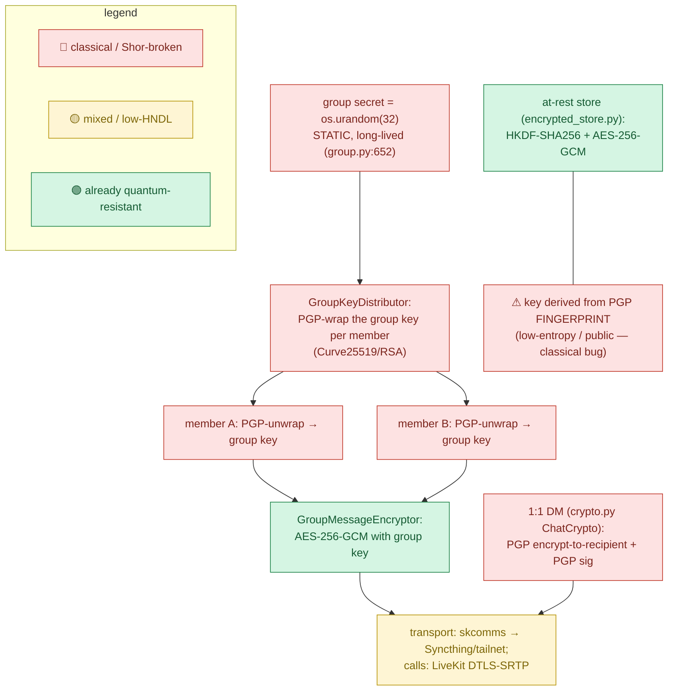
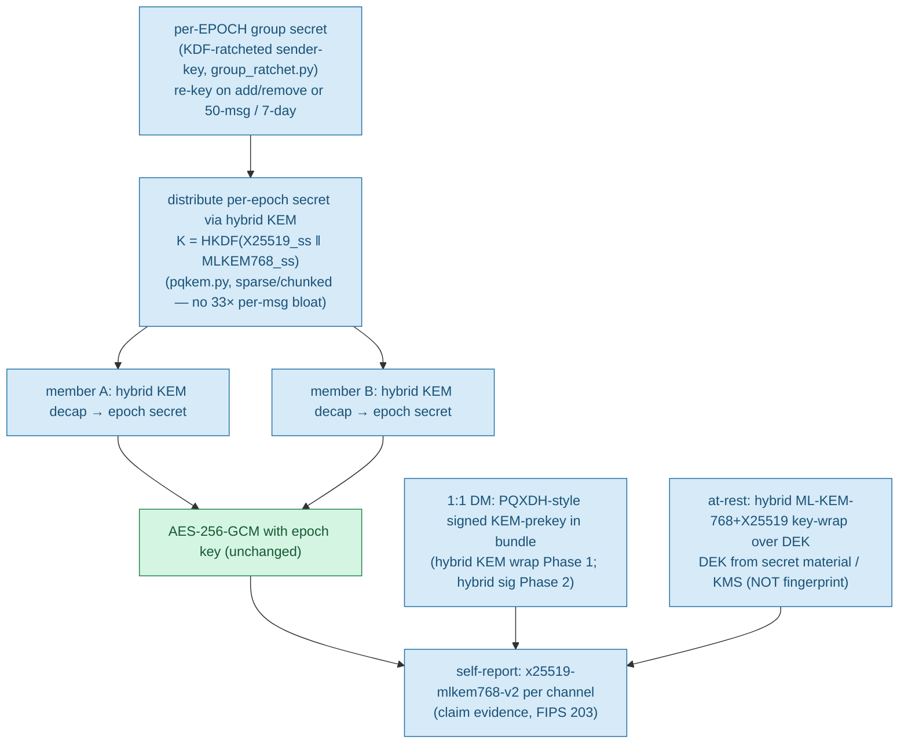
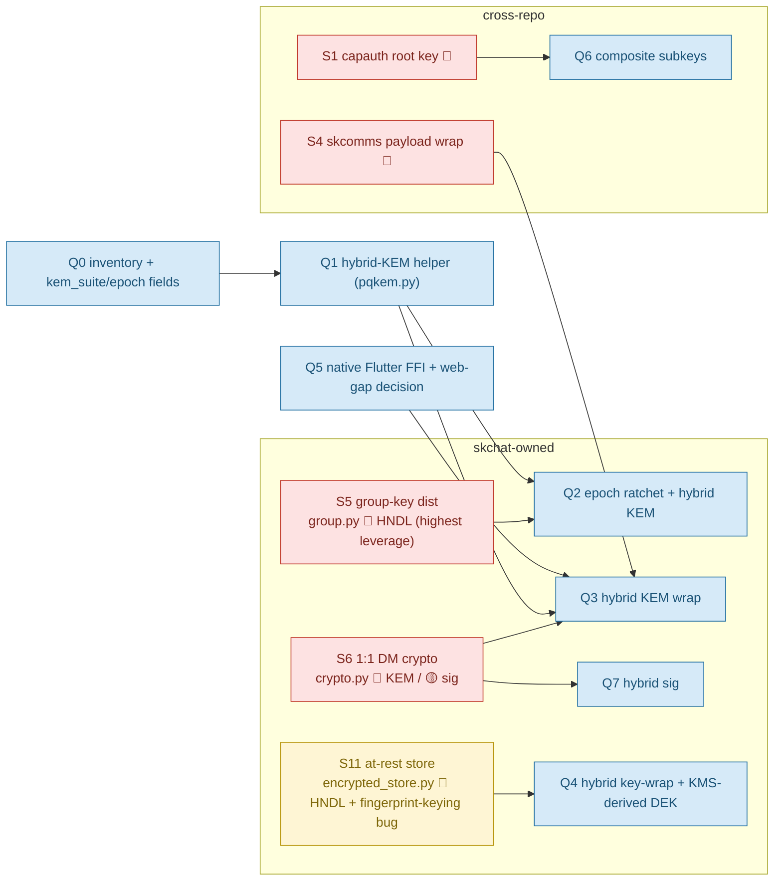
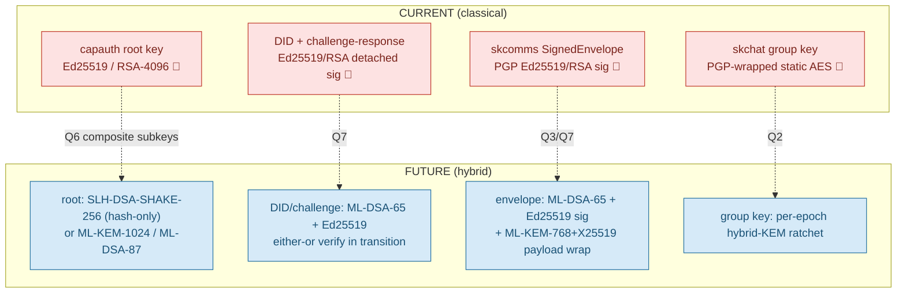

# skchat — Cryptography Architecture & Quantum-Resistance

**Status:** Documentation of current state + target state. **Docs-only** — code lands under epic `PQC-MIGRATION` (coord `e1d6ba2a`).
**Master plan:** [SK Ecosystem — Quantum-Resistance Architecture & Migration Plan](quantum-resistance-architecture.md) (source of truth, lives in this repo).
**Standards anchor:** FIPS 203 (ML-KEM), FIPS 204 (ML-DSA), FIPS 205 (SLH-DSA); NIST CSWP 39 (crypto-agility).

> This file describes the crypto surfaces **skchat owns** — group-key distribution
> (`group.py`), 1:1 DM crypto (`crypto.py`), and the at-rest store
> (`encrypted_store.py`) — plus the **SK-wide identity/key flow** that skchat
> participates in. For the full phased plan and the other repos' surfaces, read the
> master plan.

---

## 1. Honest claim status (read first)

The single rule: **every quantum-resistance claim must cite the surface + the FIPS
number + hybrid-vs-classical, and be backed by a runtime self-report.** No claim
without evidence.

### What we CAN truthfully claim TODAY (pre-Phase-1)

- **"skchat's group-message cipher and at-rest store are already quantum-resistant
  at the symmetric layer."** AES-256-GCM (`group.py:GroupMessageEncryptor`) and
  HKDF-SHA256 + AES-256-GCM (`encrypted_store.py`) are Grover-only (≥128-bit worst
  case). True now, no migration. **Only their key-wrapping / key-distribution is
  the problem.**

### What we MAY claim ONLY AFTER Phase 1 (KEM/HNDL shipped)

- "skchat group-key distribution and 1:1 DM confidentiality are protected by hybrid
  post-quantum key encapsulation — X25519 + ML-KEM-768 (FIPS 203) — with per-epoch
  ratcheted group keys. A recorded ciphertext stays secret unless *both* X25519 and
  ML-KEM-768 are broken." — claimable **only once** the group-key wrapping uses the
  hybrid combiner + epoch ratchet AND the runtime self-report proves the negotiated
  suite per channel.

### What we MAY claim ONLY AFTER Phase 2 (signatures)

- "skchat message signatures are authenticated with hybrid post-quantum signatures
  (Ed25519 + ML-DSA-65, FIPS 204)."

### NEVER say these (overclaiming)

- ❌ "quantum-proof" / "unbreakable" / "quantum-safe encryption" — use
  **"quantum-resistant"** / **"post-quantum,"** never "-proof."
- ❌ "end-to-end quantum-resistant" while any leg is classical (LiveKit DTLS,
  tailnet handshake, PGPy-signed messages, the browser/PWA leg).
- ❌ "PQC" when only signatures migrated — does nothing for HNDL.
- ❌ "CNSA 2.0 compliant" — we use the **-768 hybrid tier**, not the CNSA ceiling.
- ❌ Implying **AES-256 is "broken" by quantum** — it is not.

---

## 2. The threat model in one line

The urgent problem is **Harvest-Now-Decrypt-Later (HNDL)** against *confidentiality*:
an adversary records ciphertext **today** and decrypts after a CRQC exists (plausibly
early-to-mid 2030s). The **highest-leverage** skchat surface is **group-key
distribution** — break one member's classical key today and you recover the AES group
key and decrypt *all* group history. That is why group-key distribution is the
marquee Phase-1 item.

---

## 3. CURRENT (as-is) — how skchat crypto works today

Edges labelled: 🔴 = classical, Shor-broken; 🟡 = mixed / low-HNDL; 🟢 = already
quantum-resistant (symmetric/hash).



| Surface (file) | Today | Quantum status |
|---|---|---|
| group-key **distribution** (`group.py:652 GroupKeyDistributor`) | PGP-wrap of a **static** `os.urandom(32)` group key per member | 🔴 **HNDL + highest leverage** — break one member's classical key → recover the AES group key → decrypt *all* history |
| group-message cipher (`group.py:GroupMessageEncryptor`) | AES-256-GCM | 🟢 Grover-only, keep |
| 1:1 DM (`crypto.py:ChatCrypto.encrypt_message/sign_message`) | PGP encrypt-to-recipient + PGP sig | 🔴 KEM = HNDL; 🟡 sig = future-forgery |
| at-rest store (`encrypted_store.py`) | HKDF-SHA256 + AES-256-GCM | 🟢 symmetric — **but** key derived from PGP **fingerprint** (low-entropy/public): a *classical* bug, fix regardless of quantum |
| transport / calls (skcomms, tailnet, LiveKit DTLS-SRTP) | classical handshakes; symmetric bulk | 🟡 handshakes vulnerable (external); ephemeral media = low HNDL unless recorded |

---

## 4. FUTURE (target) — hybrid PQ + epoch-ratchet group keys

**Universal combiner (never deviate):**

```
shared_key = HKDF-SHA256( X25519_shared_secret || ML-KEM-768_shared_secret,
                          info = "<context-label>" )
```

Concatenate-then-KDF. **Never XOR, never replace** classical with PQ. Secure if
*either* primitive holds. Exactly TLS `X25519MLKEM768` / Signal PQXDH.



| Surface | Target + hybrid construction | Library path | Phase |
|---|---|---|---|
| group-key distribution (S5) | **per-epoch** secret via hybrid KEM; replace static key with KDF-ratcheted sender-key + epoch; re-key on add/remove **or** ~50-msg/7-day bound | liboqs-python ML-KEM-768 + X25519; new `group_ratchet.py` | 1 (Q2, marquee) |
| 1:1 DM KEM (S6-KEM) | hybrid KEM wrap; PQXDH-style signed KEM-prekey in bundle (~1 KB ct in first message) | liboqs-python; reuse the KEM helper | 1 (Q3) |
| 1:1 DM sig (S6-sig) | ML-DSA-65 + Ed25519 hybrid sig | Sequoia / liboqs ML-DSA | 2 (Q7) |
| at-rest (S11 / encrypted_store) | hybrid ML-KEM-768 + X25519 key-wrap over the DEK; **derive DEK from secret material / KMS, not fingerprint**; consider `age` 1.3 recipients | liboqs-python **or** `age` 1.3 | 1 (Q4) |
| suite-id fields | `GroupChat.kem_suite` + `epoch` (alongside existing `key_version`) | additive, back-compatible | 0 (Q0) |

**Forward secrecy + post-compromise security:** the epoch ratchet gives FS (old
epochs unrecoverable) and PCS (a re-key heals after compromise) — properties the
current static key has **none** of.

**Bandwidth note:** ML-KEM keys/ct are ~1 KB each (~33× ECDH) → use the **sparse
ratchet + chunking**; never naively include PQ material per message.

---

## 5. GAPS / remediation — vulnerable surfaces → fix

The master plan enumerates **11 vulnerable surfaces (S1–S11)**. skchat owns
**S5, S6, S11**; the rest are cross-referenced so the full path is visible.



| # | Surface (skchat) | Today | Quantum status | Target | Sprint |
|---|---|---|---|---|---|
| S5 | group-key distribution (`group.py:652`) | PGP-wrap of static `os.urandom(32)` per member | 🔴 HNDL + highest leverage | per-epoch hybrid-KEM ratchet (`group_ratchet.py`) | Q2 (Phase 1) |
| S6 | 1:1 DM (`crypto.py:ChatCrypto`) | PGP encrypt + PGP sig | 🔴 KEM / 🟡 sig | hybrid KEM (Q3) + hybrid sig (Q7) | Q3 / Q7 |
| S11 | at-rest store (`encrypted_store.py`) | HKDF+AES-256; DEK from PGP fingerprint | 🔴 HNDL + 🟡 low-entropy keying bug | hybrid key-wrap; DEK from secret material/KMS | Q4 (Phase 1) |

> **Note on `encrypted_store.py`:** its key is derived from the PGP **fingerprint**
> (low-entropy, often public) — a **classical** weakness independent of quantum.
> Fix by deriving from secret key material / a KMS DEK regardless of timeline.
> Folded into Phase 1 Sprint Q4.

---

## 6. SK-wide identity / key flow (where skchat sits)

skchat does not own identity — it delegates to `capauth.resolve_agent_identity`. The
identity + key-distribution flow spanning capauth → skcomms → skchat:



Identity migration (root + signatures) is **Phase 2** — signatures are not
retroactively breakable, so it is deferrable. Confidentiality (group key, DM wrap,
at-rest) is **Phase 1** — that is where HNDL bites.

---

## 7. The browser / Flutter PQC gap (constrains S5/S6)

- **WebCrypto has NO PQC API in any browser (2026).** The skchat PWA cannot get
  app-layer ML-KEM from the platform.
- **Native Flutter (Android/iOS/desktop): SOLVED** via FFI — the `oqs` pub.dev
  package (binds liboqs) or `mlkem_native`. **The liboqs native binary must be
  shipped per-platform in CI** (missing-binary at runtime is the #1 failure).
- **Web: NOT solved by the platform.** Options in order of preference:
  1. **WASM build of liboqs / mlkem-native** vendored into the PWA — workable, *we
     own the audit risk*.
  2. **Pure-Dart/JS ML-KEM** — more audit risk; avoid unless WASM is blocked.
  3. **Server-side KEM with capability-gated downgrade** — the web client advertises
     *no* PQ capability and talks to a daemon that performs the hybrid KEM on its
     behalf over a PQ-TLS channel. Honest, but the web leg's E2E PQ property is
     **weaker and must be disclosed in the claim.**
- **Open decision (surfaced, not decided here):** native-only PQ now (the
  recommendation), WASM-liboqs later, or a non-Flutter client. Until resolved,
  **native clients get full hybrid KEM and the web PWA is documented as a
  reduced-assurance leg.** No claim may imply the browser is E2E PQ. This is a
  possible future pivot point and is on record (master plan §7, decision 1).

See the master plan §3.1 and §7 for the full tradeoff.

---

## 8. Cross-links

- **Master plan / source of truth:** [`quantum-resistance-architecture.md`](quantum-resistance-architecture.md)
- **skcomms crypto view:** `../../skcomms/docs/crypto-architecture.md`
- **capauth crypto view:** `../../capauth/docs/CRYPTO_SPEC.md`
- **Ecosystem standard:** SKStacks `docs/CRYPTOGRAPHY_STANDARD.md`
- **Epic:** `PQC-MIGRATION` (coord `e1d6ba2a`), tag `quantum-resistance` — runs
  alongside the comms-suite epic, side-tabbable.
