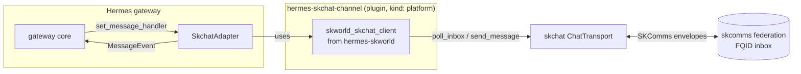

# skchat → Hermes Messaging-Platform Channel — Architecture & Epic

> **Goal:** make **skchat a first-class Hermes channel** (like the v17 iMessage / WhatsApp /
> SimpleX adds), so any Hermes agent is reachable over the **sovereign skchat/skcomms
> network** and replies as its own **FQID identity** — alongside Telegram et al., with
> **zero edits to the Hermes source tree** (survives `hermes update`).
>
> Grounded in the real source: `~/clawd/tools/hermes-agent/gateway/platforms/base.py`
> (`BasePlatformAdapter`), `hermes_cli/plugins.py` (plugin/hook system), and
> `skchat/transport.py` (`send_message` / `poll_inbox`).

---

## 1. The contract we implement (Hermes side)

A channel is a subclass of **`BasePlatformAdapter(ABC)`** with **4 abstract methods**:

| Method | Signature | skchat mapping |
|---|---|---|
| `connect(*, is_reconnect=False)` | → `bool` | start the **inbox poller** task (skcomms preserves the queue → reconnect-safe) |
| `disconnect()` | → `None` | stop the poller, close the transport |
| `send(chat_id, content, reply_to=None, metadata=None)` | → `SendResult` | build a `ChatMessage`, `transport.send_message(...)`, map delivery report → `SendResult` |
| `get_chat_info(chat_id)` | → `dict{name,type}` | resolve FQID/group via the skcomms directory |

Plus the **normalized models** (we produce/consume these, not skchat's raw types):
- **Inbound → `MessageEvent`** (text, `message_type`, `media_urls` = local cached paths, `source: SessionSource`, reply context). We call `self._message_handler(event)`.
- **Outbound → `SendResult`** (`success`, `message_id`, `error`, `retryable`, `retry_after`, `error_kind`).
- **`SessionSource`** carries identity/routing: `platform`, `chat_id`, `chat_type` (`dm|group|thread`), `user_id`, `thread_id`, etc.

**Registration (no source edits):** a `plugin.yaml` with `kind: platform` + a `register(ctx)` that calls `ctx.register_platform(name="skchat", adapter_cls=SkchatAdapter, ...)`. `hermes_cli/plugins.py` discovers it; it survives `hermes update`.

## 2. The skchat surface we drive (SKWorld side)

- **Receive:** `ChatTransport.poll_inbox(sender_public_armor=None) → list[ChatMessage]` — pulls pending SKComms envelopes, decrypts, stores in ChatHistory, returns them. (Also reachable via the daemon `/api/v1/inbox`.)
- **Send:** `ChatTransport.send_message(message: ChatMessage, recipient_public_armor=None) → dict` — encrypts + serializes into an SKComms envelope + routes over the available transports; returns a delivery report (`delivered` bool + details).
- **Identity:** FQIDs `agent@operator.realm` (e.g. `lumina@chef.skworld.io`). DMs = peer FQID; groups/threads = group id.
- **Media:** `ChatMessage` attachments ↔ Hermes `media_urls` (cache to `get_image_cache_dir()` etc.).

**Receive-model choice:** skchat is a **sovereign daemon with a push-inbox**, not a cloud webhook — so the adapter mirrors the **SimpleX "native platform plugin" shape** (a `connect()`-owned async poll/subscribe loop calling the handler), *not* the Telegram long-poll-a-cloud-API or the WhatsApp webhook model. Start with an interval poll of `poll_inbox()`; upgrade to a daemon push/subscribe later (P4+).

---

## 3. Architecture — `SkchatAdapter(BasePlatformAdapter)`



- **Receive loop** (in `connect()`): every N s (or on daemon signal) → `client.poll_inbox()` → for each `ChatMessage`: normalize → `MessageEvent` (`source=SessionSource(platform=SKCHAT, chat_id=<FQID|group>, chat_type=…, user_id=<sender FQID>)`, `media_urls` from attachments, reply context from thread) → `await self._message_handler(event)`.
- **Send** (`send()`): map Hermes `chat_id` → a skchat recipient (DM FQID or group), build `ChatMessage(from=<this agent's FQID>, …, body=content, reply_to=…)`, `client.send_message(msg)` → map `{delivered, …}` → `SendResult`. Override `send_image/voice/video/document` → attachments.
- **Identity mapping:** the Hermes agent ↔ its skchat FQID (per-agent: `lumina@chef.skworld.io` on .158, `opus@…`/`jarvis@…` on .41). `chat_id` = the peer FQID (DM) or group id.
- **Consent (cross-cut):** an inbound from an **unknown** FQID routes through the existing **SKFed consent pipeline** (`skcomms.consent_pipeline`) *before* it becomes a `MessageEvent` — first-contact quarantine, not auto-deliver. Reuses the work already shipped.
- **Platform enum:** add `SKCHAT` to Hermes's `Platform` enum **or** register as a plugin-provided platform string (P1 spike decides — prefer no-core-edit if `register_platform` supports it).

---

## 4. The refactor — `hermes-skworld` shared base (your ask)

**Today:** `hermes-skchat-rating` is a single `kind: platform` plugin (a Telegram adapter subclass) that embeds its own skchat calls. Adding the channel would **duplicate** the skchat client + config.

**Refactor → a shared base + siblings:**
```
hermes-skworld/                 # NEW shared plugin package (kind: library)
  plugin.yaml
  skworld_skchat_client.py      # the ONE skchat/skcomms client (send_message, poll_inbox, identity, media, crypto)
  skworld_config.py             # per-agent FQID, endpoints, poll interval, consent mode
  skworld_base.py               # optional shared adapter mixin (media caching, error mapping)
hermes-skchat-rating/           # refactored → depends on hermes-skworld
  plugin.yaml   (pip_dependencies: [hermes-skworld>=0.1])
  telegram_rating_adapter.py    (uses skworld_skchat_client instead of inline calls)
hermes-skchat-channel/          # NEW → depends on hermes-skworld
  plugin.yaml   (kind: platform, pip_dependencies: [hermes-skworld>=0.1])
  skchat_adapter.py             (SkchatAdapter(BasePlatformAdapter))
```
Bump `hermes-skworld` → both plugins update on `hermes plugins sync`. One skchat client, no duplication, both survive `hermes update`. Matches the **SKWorld Host-Plugin Pattern** (owned core → thin per-host adapter → registration).

---

## 5. Epic / Sprint

**Epic:** *skchat as a sovereign Hermes messaging channel (+ shared hermes-skworld base).*

| Phase | Tasks | Acceptance |
|---|---|---|
| **P0 — Shared base + refactor** | Extract `skworld_skchat_client` + `skworld_config` from the rating plugin into new `hermes-skworld`; refactor `hermes-skchat-rating` to depend on it (behavior-identical); publish/install `hermes-skworld` | Rating loop still works; zero skchat-client duplication; `hermes plugins sync` resolves the dep |
| **P1 — Adapter skeleton + registration** | `SkchatAdapter(BasePlatformAdapter)` with `connect/disconnect/get_chat_info`; `plugin.yaml kind: platform` + `register→ctx.register_platform`; **spike:** Platform enum vs plugin-platform | `hermes` loads the `skchat` platform + connects (no receive/send yet) |
| **P2 — Receive** | poller → `poll_inbox()` → normalize `ChatMessage`→`MessageEvent`; identity map FQID→`SessionSource`; fire handler; **consent gate** for unknown senders | A skchat DM to the agent's FQID becomes a `MessageEvent`; unknown sender is quarantined not auto-delivered |
| **P3 — Send** | `send()`→`ChatMessage`→`send_message`→`SendResult`; error classification | Full round-trip: DM in → agent replies → reply arrives over skchat as the agent's FQID |
| **P4 — Media / groups / reactions** | attachment↔`media_urls` (in+out), group/thread mapping, reactions if supported; consider daemon push/subscribe over interval-poll | Image + group message round-trip; media cached + vision-usable |
| **P5 — Multi-agent, packaging, survive-update, deploy** | per-agent config (lumina@.158, opus/jarvis@.41); install flow; docs + SOP; deploy on both nodes | Installed on .158 + .41 with each agent's FQID; **persists across a `hermes update`**; SOP written |

**Cross-cutting:** encryption (reuse skchat crypto), consent (reuse `skcomms.consent_pipeline`), observability (log delivery reports), and the SKWorld doc-SOP standard.

**Risks / open questions:**
1. **Platform enum** — does `register_platform` allow a non-enum platform string, or must we add `Platform.SKCHAT` (a core edit)? → P1 spike; prefer no-core-edit.
2. **Poll vs push** — interval poll (simple, P2) vs daemon subscribe (efficient, P4). Start simple.
3. **Multi-agent identity** — each Hermes instance binds one agent FQID; config-per-node.
4. **Consent UX in Hermes** — how first-contact quarantine surfaces to the operator inside Hermes.

---

## 6. See also
- Hermes contract: `~/clawd/tools/hermes-agent/gateway/platforms/base.py`, `hermes_cli/plugins.py`, `gateway/platforms/telegram.py` (reference)
- skchat: `skchat/transport.py` (`send_message`/`poll_inbox`), `daemon.py`
- Federation + consent: `skcomms/` (`consent_pipeline`, FQID inbox), `docs/skfed-federation-guide.md`
- Pattern: SKWorld Host-Plugin Pattern; existing `hermes-skchat-rating`
