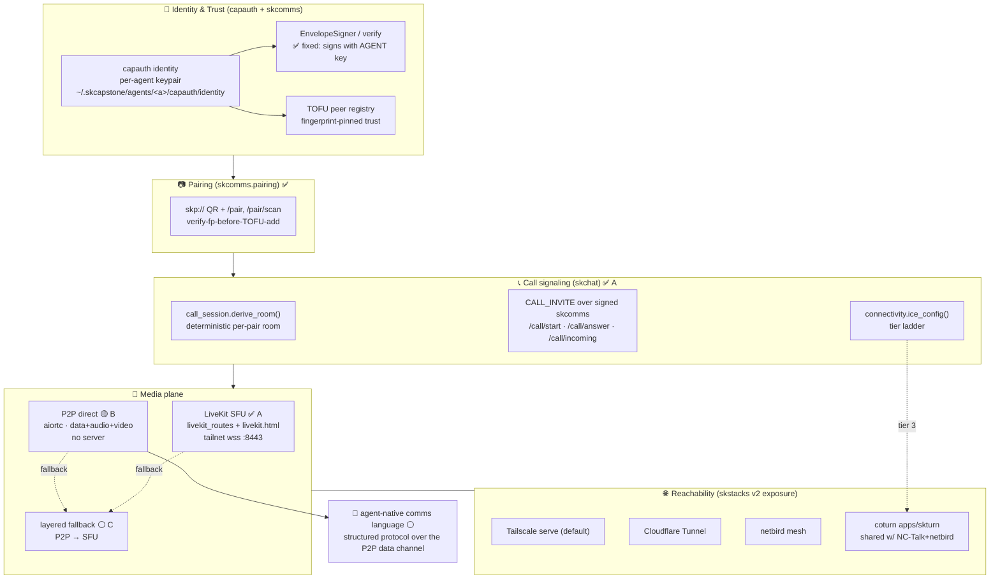
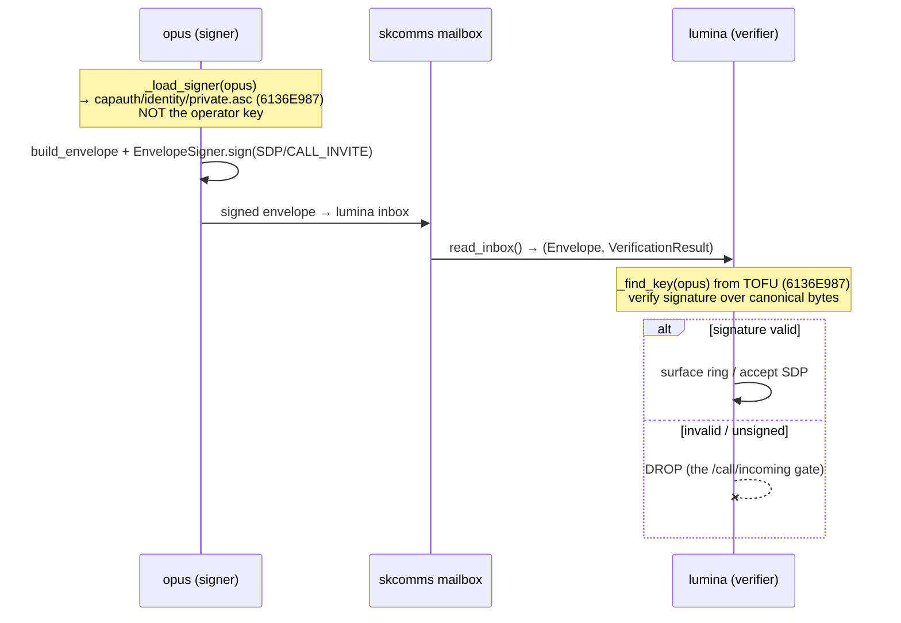
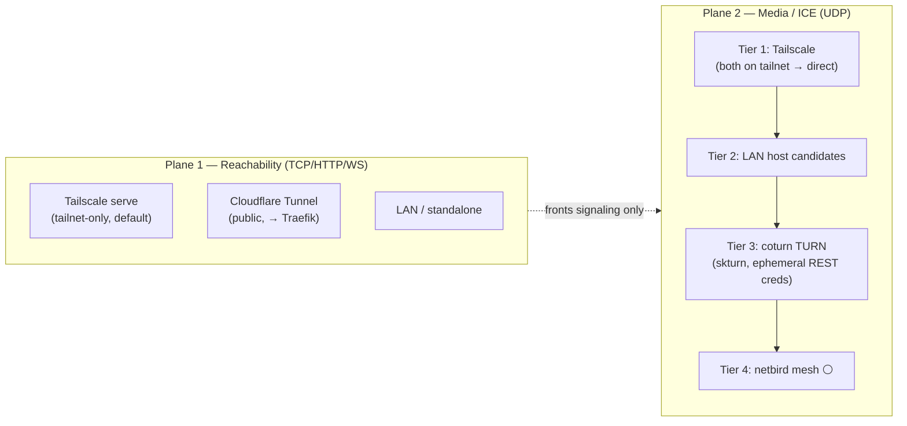
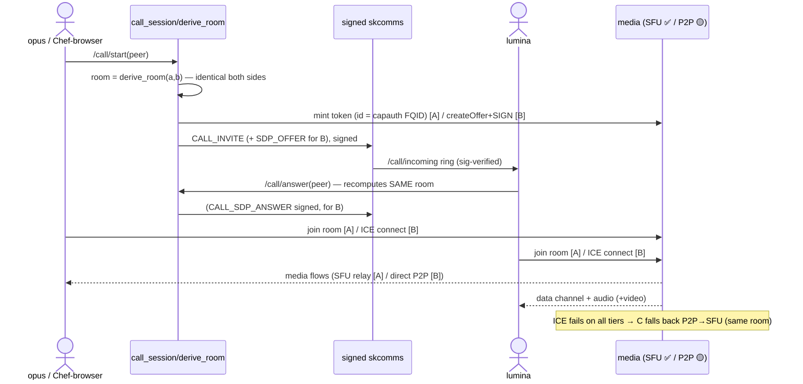
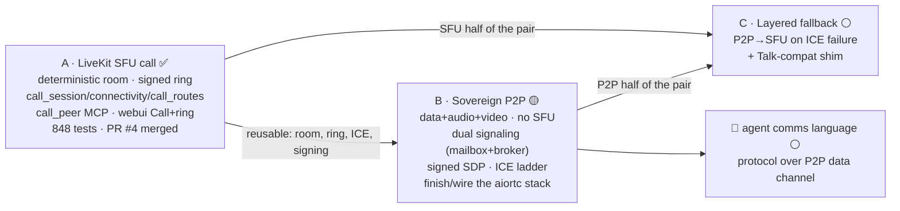

# SKChat WebRTC — Architecture Overview & Design Record

**Date:** 2026-06-11
**Scope:** "WebRTC session after pairing" (coord `7f28ac51`) — the full sovereign
real-time-comms stack: pairing → signed call signaling → media (SFU + P2P) → the
agent-native-comms-language north star.
**Status legend:** ✅ shipped · 🟡 designed/in-progress · ⚪ planned

This is the canonical map. Per-piece detail lives in the sibling specs/plans:
- `2026-06-11-skchat-webrtc-session-A-design.md` + `…-A.md` (plan) — ✅ merged (PR #4)
- `2026-06-11-skchat-webrtc-session-B-design.md` — 🟡 spec'd
- `2026-06-11-nextcloud-talk-fit-decision.md` — the build-our-own decision
- skcomms signing fix — ✅ merged (skcomms PR #5)

---

## 1. Where we are in the stack

## 2. Trust & signing flow (the sovereign guarantee)

Every cross-agent message is capauth-signed and verified against the peer's
TOFU-pinned fingerprint. **The 2026-06-11 fix:** agents were signing with the
*operator* key (wrong path) so nothing verified — now each agent signs with its own
`capauth/identity` key. This is what makes "trust level by profile" real.

## 3. Connectivity — two planes + the tier ladder

Reachability (how a client reaches the HTTP/WS) and media/ICE (how WebRTC traverses
NAT) are **different planes**. Cloudflared can front signaling but never relays UDP media.

## 4. Call-after-pairing sequence (A shipped, B designed)

## 5. The A → B → C decomposition

## 6. Component → file map

| Concern | Module(s) | Repo | State |
|---|---|---|---|
| Deterministic room + CALL_INVITE | `call_session.py` | skchat | ✅ |
| ICE tier ladder | `connectivity.py` | skchat | ✅ |
| Call routes (`/call/*`, `/connectivity/ice`) | `call_routes.py` | skchat | ✅ |
| `call_peer` MCP tool | `mcp_server.py` | skchat | ✅ |
| Call UI (Call btn, ring banner, peers) | `webui.py` | skchat | ✅ |
| LiveKit join page (qp room/identity/token + ICE) | `static/livekit.html` | skchat | ✅ |
| LiveKit token mint | `livekit_routes.py` | skchat | ✅ |
| Pairing (QR/TOFU) | `pairing.py` | skcomms | ✅ |
| **Per-agent signing key** | `mailbox.py`, `grants.py` | skcomms | ✅ (PR #5 fix) |
| P2P transport (data channel ✅, media/sign 🟡) | `transports/webrtc*.py` | skcomms | 🟡 B |
| Mailbox signaling (sovereign SDP/ICE) | `transports/signaling_mailbox.py` | skcomms | ✅ B |
| Broker signaling (fast path) | `transports/signaling_broker.py` + `signaling_base.py` | skcomms | ✅ B (live-broker validation pending) |
| P2P session (data+audio+video) | `transports/p2p_session.py` | skcomms | ✅ B |
| P2P connector / **session manager** | `transports/p2p_connector.py` / `p2p_manager.py` | skcomms | ✅ B |
| skchat P2P glue + MCP tools | `p2p_calls.py` (`p2p_call/listen/status/send`) | skchat | ✅ B |
| **Layered fallback** (P2P→SFU) | `call_orchestrator.py` (`call_auto` tool) | skchat | ✅ C |
| Operator observability (alert+join) | `call_observability.py` (topic + sk-alert) | skchat | ✅ (e8651a65) |
| coturn standalone | `apps/skturn` | SKStacks v2 | 🟡 (other session) |

## 7. Design decisions (log)

1. **Build our own core, don't reimplement Nextcloud Talk.** Research swarm verdict: Talk
   clients are tightly server-coupled; a drop-in backend is XL/permanent-tax; LiveKit
   already gives the same "signed-JWT identity into the media plane" as spreed. Talk stays
   a *deferred additive chat bridge* (test host `skhub.nativeassetmanagement.com`).
2. **Deterministic per-pair room** (hash of sorted FQIDs) → zero-negotiation room agreement;
   also the free landing zone for C's fallback.
3. **Identity = capauth FQID** in every token/credential; **verify-before-add** /
   **verify-before-surface** on every hop (sovereign trust by profile).
4. **Two planes** (reachability vs media) — cloudflared for signaling, coturn for media.
5. **coturn standalone** (`apps/skturn`), decoupled from the month-down skhub stack; shared
   secret with NC-Talk + netbird.
6. **"If you need one, get two"** — dual signaling (mailbox+broker), three media modalities
   (video graceful-degrades), full ICE ladder, P2P+SFU transports. No single point of failure.
7. **Signed SDP** (B) reuses the per-agent signing fix — no MITM on media negotiation.

## 8. Live status (2026-06-12)
- **A (LiveKit SFU) shipped** (skchat PR #4, tag `webrtc-A-v1`). **B (sovereign P2P) +
  C (P2P→SFU fallback) shipped** → main (tag `webrtc-BC-v1`). skcomms 145 + skchat 863 tests.
- Verified: signed CALL_INVITE ring end-to-end; signed mailbox SDP signaling (opus→lumina);
  direct P2P data+audio channel (aiortc loopback); manager auto-answer; `call_auto` fallback.
- MCP tools live: `call_peer` (SFU), `p2p_call`/`p2p_listen`/`p2p_status`/`p2p_send` (P2P),
  `call_auto` (P2P-first + SFU fallback). Operator alert (topic + one-press join) on `/call/start`.
- Browser media leg proven; **Lumina's conversational agent in `lumina-and-chef`** (audio +
  77 MCP tools). Runbooks: `qr-pairing-phone-test.md`, `browser-call-test.md`.
- **Open:** live-broker validation of BrokerSignaling (needs the skcomm daemon broker up);
  Tailscale Funnel public pairing (`2ab5aa6c`, outward-facing — operator-gated). **🔴 live
  voice blocked by `.100` F5-TTS on the wedged Arc iGPU (no CUDA for the 5060 Ti).**
